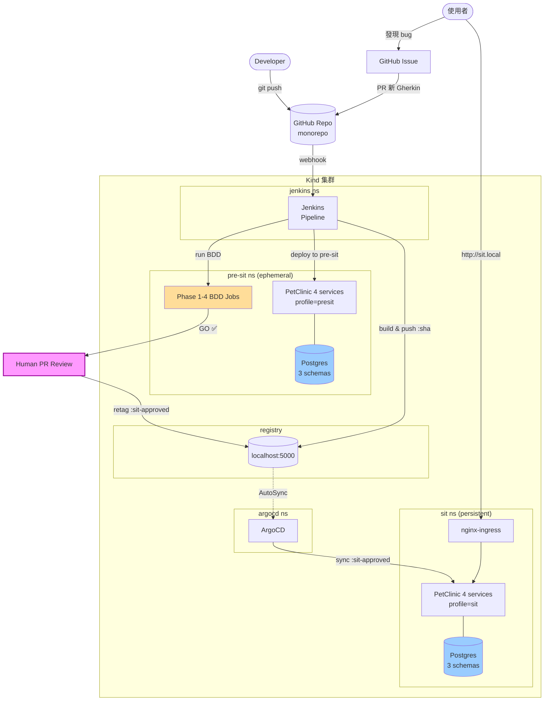
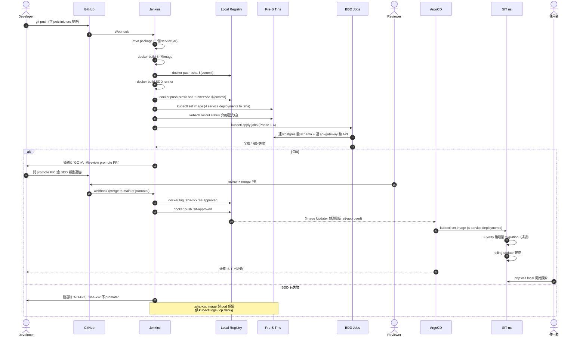
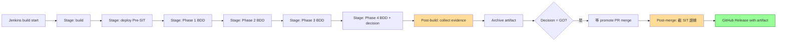
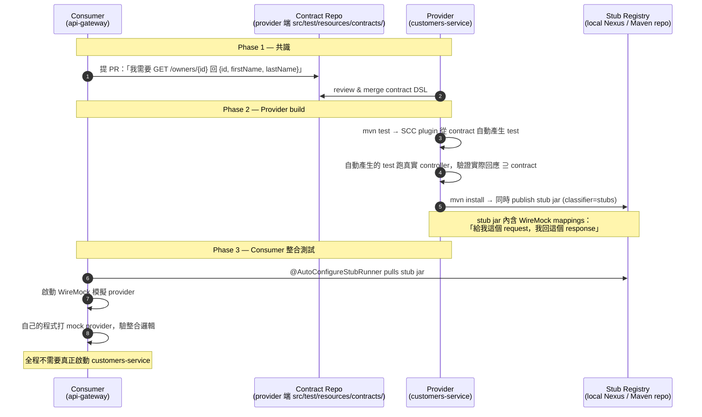

# Pre-SIT 容器化資料庫驗證工作計畫書（v2.2）

**文件版本**: v2.2  
**建立日期**: 2026-05-16  
**最後更新**: 2026-05-16  
**負責部門**: 應用架構團隊  
**狀態**: ✅ **現行版本**（v2.1 為上一代 baseline，保留供對比）

**核心變更摘要**:  
v2.1 為 *plan-faithful + upstream image* 折衷版（已達 GO，但 Phase 1 驗的 Postgres ≠ 應用實際用的 HSQLDB）。**v2.2 走相反路線**：

1. **自行 vendor PetClinic source code** 進 monorepo (`petclinic-src/`)
2. **PetClinic 改用 PostgreSQL**（加 Flyway migration）
3. **雙環境**：Pre-SIT（ephemeral，跑 BDD）+ SIT（persistent，使用者探索）
4. **拋棄 Spring Cloud Config + Eureka**，全面改用 K8s 原生機制
5. **加入 Jenkins** 自動化 build → push → 觸發 BDD
6. **手動 promote**（image retag `:sha-xxx` → `:sit-approved`）+ **ArgoCD AutoSync** 到 SIT
7. **探索測試 bug → 新 Gherkin 場景** 的閉迴路 workflow

完整 19 項決策請見 §3。

---

## 目錄

1. [背景與動機](#1-背景與動機)
2. [雙環境架構總覽](#2-雙環境架構總覽)
3. [19 項決策決議表](#3-19-項決策決議表)
4. [專案結構（monorepo）](#4-專案結構monorepo)
5. [Build → Promote → Deploy 流水線](#5-build--promote--deploy-流水線)
6. [Schema migration（Flyway）策略](#6-schema-migrationflyway策略)
7. [探索測試 Bug → Gherkin 場景閉迴路](#7-探索測試-bug--gherkin-場景閉迴路)
8. [測試證據蒐集策略](#8-測試證據蒐集策略)
9. [Spring Cloud Contract（消費者契約測試）](#9-spring-cloud-contract消費者契約測試)
10. [實施階段（修訂後甘特圖）](#10-實施階段修訂後甘特圖)
11. [風險登記冊](#11-風險登記冊)
12. [v2.1 → v2.2 變更對照](#12-v21--v22-變更對照)
13. [v2.2 → v2.3 規劃 backlog](#13-v22--v23-規劃-backlog)
14. [批准與簽署](#14-批准與簽署)

---

## 1. 背景與動機

### 1.1 v2.1 的限制（為何需要 v2.2）

v2.1 在 `Pre-SIT_Work_Plan_v2.1.md §1.3 C1` 已誠實標示：

> upstream PetClinic image 預設使用 **HSQLDB**，無 `postgres` profile。Phase 1 驗證的 Postgres ≠ 應用實際使用的 DB。若要端對端綁定，必須重 build PetClinic。

v2.1 接受了這個折衷以保持「不修改 upstream image」原則。v2.2 反過來：**接受重 build 的成本，換來 schema 端對端一致性**，並把架構延伸到一個更完整的「Pre-SIT + SIT 雙環境」demo。

### 1.2 v2.2 解決的新問題

| v2.1 未解的問題 | v2.2 對策 |
|---|---|
| Phase 1 驗 Postgres 但應用用 HSQLDB → schema 驗證形同空轉 | PetClinic 真連 Postgres、Flyway 管 schema |
| 沒有「探索性測試環境」概念 | 拆出 SIT namespace 給人工測試 |
| BDD 通過後就斷線、無下游消費者 | SIT 經 ArgoCD AutoSync 接收 `:sit-approved` image，PetClinic UI 給使用者操作 |
| 探索測試發現的 bug 無正式回饋路徑 | GitHub Issue template + PR template，將 bug → 新 Gherkin 場景 |
| upstream 升級時無 fork 管理機制 | monorepo vendoring (`petclinic-src/`)，明確指版本，內部修改不衝 upstream |
| Spring Cloud Config + Eureka 是 PoC 雜訊（非主題） | 改用 K8s ConfigMap + Service DNS，pod 數從 6 降為 4 |
| build / push / deploy 全手動 | Jenkins on Kind 自動化（push → build → BDD → 等 promote） |

---

## 2. 雙環境架構總覽

### 2.1 整體流向



### 2.2 雙環境職責對照

| 面向 | Pre-SIT | SIT |
|------|---------|-----|
| **目的** | BDD 自動化驗證 | 使用者探索性測試 |
| **DB 生命週期** | 每次 deploy 重建 | 永不 reset（資料累積） |
| **DB schema 管理** | Flyway `clean` + `migrate`（全跑） | Flyway `migrate`（只跑增量） |
| **應用 profile** | `presit` | `sit` |
| **Pod 生命週期** | 常駐，下次 build 才 rolling update | 常駐，ArgoCD 自動同步新 image |
| **對外暴露** | 無（測試完即可） | nginx-ingress → http://sit.local |
| **Promote 進來** | Jenkins build 完即 deploy | 人工 PR review 後 retag `:sit-approved`，AutoSync 接手 |
| **失敗處理** | BDD failure → 不 promote、image 標 `:sha-xxx`（不退 :sit-approved） | 應用啟動 fail → fail-fast，ArgoCD 顯示 OutOfSync/Degraded |

### 2.3 Pod 數對比（v2.1 vs v2.2）

```
v2.1 (單環境)                v2.2 (雙環境)
─────────────────           ─────────────────
postgres            x1       postgres            x2 (Pre-SIT + SIT)
config-server       x1       (拋棄)
discovery-server    x1       (拋棄)
customers-service   x1       customers-service   x2
vets-service        x1       vets-service        x2
visits-service      x1       visits-service      x2
api-gateway         x1       api-gateway         x2
                             nginx-ingress       x1
                             jenkins             x1
────────────────             ────────────────
共 6 個應用 pod                共 11 個應用 pod
+ argocd + bdd runner        + argocd + bdd runner
```

雖然 pod 數從 6 增到 11，但因拋棄 config-server + Eureka，**單個應用 pod 的記憶體用量降低約 100MB**（沒有 Eureka client 註冊與心跳）。Kind 集群最低 RAM 需求：v2.1 約 4GB → v2.2 約 6GB。

---

## 3. 19 項決策決議表

> 決策過程的問答軌跡保留在開發討論紀錄。本表為最終裁定。

| # | 議題 | 決議 | 替代方案 | 理由 |
|---|------|------|---------|------|
| **1** | Schema migration 工具 | **Flyway** | Liquibase / Hibernate ddl-auto | Spring Boot 原生整合、SQL-based、Pre-SIT/SIT 同一份 migration 可重放 |
| **2** | DB 拆分粒度 | **三 schema 同 Postgres 實例**（customers_schema / vets_schema / visits_schema） | 共用 schema / 三個 Postgres | 滿足 service 隔離精神，又不用維護三個 DB 實例 |
| **3** | Promote 機制 | **手動 PR review** | ArgoCD AutoSync / 排程 | 受監管業務常見作法、留下審核軌跡 |
| **4** | Source code 管理 | **Monorepo vendoring**（`petclinic-src/`） | Git submodule / subtree / 外部 repo | 教學情境下零學習門檻，修改自由 |
| **5** | Spring profile | **`presit` + `sit`** 兩個 | 單 docker profile + env var | 環境特定差異固化在 profile 內，可讀性高 |
| **6** | 配置來源 | **K8s ConfigMap + Secret**（拋棄 config-server） | 雙軌：config-server + ConfigMap override | Cloud Native 標準作法，拋棄 SPOF |
| **7** | Promote 單位 | **Image tag**（`:sha-xxx` → `:sit-approved`） | Git commit / Helm chart version | 同一 image binary、可重現、可回滾 |
| **8** | PoC 範圍 | **含 bug → Gherkin workflow** | 只到 Pre-SIT 綠燈 | 演示完整反饋閉迴路 |
| **9** | Service Discovery | **K8s Service DNS**（拋棄 Eureka） | 保留 Eureka / 雙軌 | K8s 原生機制、移除 Eureka 心跳開銷 |
| **10** | CI 工具 | **Jenkins on Kind** | GitHub Actions / Argo Workflows | 教學示範 self-hosted full CI/CD 鏈 |
| **11** | SIT 對外暴露 | **Ingress + nginx-ingress-controller** | NodePort / port-forward | 接近真實企業部署 |
| **12** | Bug 載體 | **GitHub Issue template + PR template** | Jira / Markdown only | 與 GitHub Actions 易整合、低門檻 |
| **13** | SIT deploy trigger | **ArgoCD AutoSync** | 手動 sync / Jenkins direct apply | Tag 推上即部署、保留 GitOps 可追蹤性 |
| **14** | Postgres 拓樸 | **Pre-SIT 與 SIT 各一個 Postgres 16** | 共用 + DB level 隔離 / 跨版本相容性測試 | 隔離乾淨、版本一致 |
| **15** | Observability | **不納入 v2.2** | Loki / Prometheus / Grafana | 範圍控制；列入 v2.3 主題 |
| **16** | 失敗 image 處理 | **保留作為 debug 證據** | 自動清除 / 標 `:failed-xxx` | Pre-SIT pod 與 image 都留著、下個 sha 來才取代 |
| **17** | Pre-SIT pod 生命週期 | **常駐**（下次 build 才重建） | TTL 清除 / 每次 reset | `kubectl logs / cp` 隨時可用 |
| **18** | Secret 管理 | **K8s Secret 明文於 manifests**（PoC 簡化） | Sealed Secrets / External Secrets Operator | PoC 範圍控制；prod 應升級 |
| **19** | UI 探索範圍 | **完整 PetClinic SPA UI** | API only / Swagger | 使用者看得到 UX、探索面向更廣 |

---

## 4. 專案結構（monorepo）

```
pre-site-tutorial/
├── README.md                              ⭐ 教學入口（更新後指向 v2.2）
├── Pre-SIT_Work_Plan_v2.md                v2.0 baseline（歷史保留）
├── Pre-SIT_Work_Plan_v2.1.md              v2.1 PoC 校準版（歷史保留）
├── Pre-SIT_Work_Plan_v2.2.md              ⭐ 本檔（現行版本）
├── Pre-SIT_Gherkin_to_Script_Guide.md     Gherkin → Java 對應教學
│
├── .github/
│   ├── ISSUE_TEMPLATE/
│   │   └── sit-exploration-bug.yml        ⭐ 探索性測試 bug 表單
│   └── pull_request_template.md           ⭐ 統一 PR 描述格式
│
├── petclinic-src/                         ⭐ vendored PetClinic 源碼
│   ├── README-vendoring.md                說明 vendor 來源版本與本地修改
│   ├── pom.xml                            parent pom
│   ├── spring-petclinic-customers-service/
│   │   ├── pom.xml                        加 PG driver + Flyway
│   │   └── src/main/
│   │       ├── java/                      ※ 不改 (除非有 bug fix)
│   │       └── resources/
│   │           ├── application.yml        加 presit / sit profile
│   │           └── db/migration/          ⭐ Flyway scripts
│   │               ├── V1__init_schema.sql
│   │               ├── V2__seed_data.sql
│   │               └── V3__add_*.sql      (未來增量)
│   ├── spring-petclinic-vets-service/     (同上結構)
│   ├── spring-petclinic-visits-service/   (同上結構)
│   └── spring-petclinic-api-gateway/      改路由用 K8s DNS
│
├── jenkins/                               ⭐ Jenkins 安裝資源
│   ├── jenkins-install.yaml               Deployment + Service + PVC
│   ├── jenkins-rbac.yaml                  ServiceAccount + kubectl 權限
│   ├── plugins.txt                        必要 plugin 清單
│   └── seed-job/
│       └── Jenkinsfile                    Pipeline 主腳本
│
├── presit-bdd-demo/                       (保留 v2.0/v2.1 內容)
│   ├── features/                          v2.0 demo (歷史)
│   ├── step-definitions/                  v2.0 demo (歷史)
│   ├── poc/                               v2.1 完整 PoC (歷史)
│   └── poc-v2.2/                          ⭐ v2.2 PoC（另議實作）
│
└── manifests/                             ⭐ 環境 K8s manifests（新位置）
    ├── kind/
    │   └── kind-config.yaml               +Ingress port mapping
    ├── pre-sit/
    │   ├── 00-namespace.yaml
    │   ├── 10-postgres.yaml
    │   ├── 20-petclinic-services.yaml     四服務 + ConfigMap + Secret
    │   ├── 30-bdd-jobs.yaml
    │   └── 99-rbac.yaml
    ├── sit/
    │   ├── 00-namespace.yaml
    │   ├── 10-postgres.yaml
    │   ├── 20-petclinic-services.yaml
    │   ├── 30-ingress.yaml                ⭐ nginx-ingress route
    │   └── 99-rbac.yaml
    ├── argocd/
    │   ├── app-pre-sit.yaml               指向 manifests/pre-sit/
    │   └── app-sit.yaml                   指向 manifests/sit/（AutoSync）
    └── nginx-ingress/
        └── install.yaml                   ingress-nginx controller

```

---

## 5. Build → Promote → Deploy 流水線

### 5.1 完整序列



### 5.2 Jenkinsfile 結構（草稿）

```groovy
pipeline {
  agent any

  environment {
    REGISTRY = 'localhost:5000'
    SHA      = sh(returnStdout: true, script: 'git rev-parse --short HEAD').trim()
  }

  stages {
    stage('Build PetClinic services') {
      steps {
        sh '''
          cd petclinic-src
          mvn -B clean package -DskipTests
          for svc in customers-service vets-service visits-service api-gateway; do
            docker build -t ${REGISTRY}/petclinic-${svc}:sha-${SHA} \
              -f spring-petclinic-${svc}/Dockerfile spring-petclinic-${svc}
            docker push ${REGISTRY}/petclinic-${svc}:sha-${SHA}
          done
        '''
      }
    }

    stage('Build BDD runner') {
      steps {
        sh '''
          cd presit-bdd-demo/poc-v2.2/bdd
          docker build -t ${REGISTRY}/presit-bdd-runner:sha-${SHA} .
          docker push ${REGISTRY}/presit-bdd-runner:sha-${SHA}
        '''
      }
    }

    stage('Deploy Pre-SIT') {
      steps {
        sh '''
          kubectl apply -f manifests/pre-sit/
          for svc in customers-service vets-service visits-service api-gateway; do
            kubectl -n pre-sit set image deployment/${svc} \
              app=${REGISTRY}/petclinic-${svc}:sha-${SHA}
          done
          for svc in customers-service vets-service visits-service api-gateway; do
            kubectl -n pre-sit rollout status deployment/${svc} --timeout=300s
          done
        '''
      }
    }

    stage('Run BDD Phase 1-4') {
      steps {
        sh '''
          kubectl delete jobs -n pre-sit -l app=presit-validation --ignore-not-found
          envsubst < manifests/pre-sit/30-bdd-jobs.yaml | kubectl apply -f -
          kubectl wait --for=condition=complete --for=condition=failed \
            job/presit-phase4-e2e-decision -n pre-sit --timeout=1800s
        '''
      }
    }

    stage('Verify GO decision') {
      steps {
        sh '''
          DECISION=$(kubectl logs job/presit-phase4-e2e-decision -n pre-sit \
            | grep -oE 'decision":"[A-Z]+' | cut -d'"' -f3)
          if [ "$DECISION" != "GO" ]; then exit 1; fi
        '''
      }
    }
  }

  post {
    success {
      slackSend "✅ Build ${SHA} Pre-SIT GO — 等待 promote PR review"
    }
    failure {
      slackSend "❌ Build ${SHA} 失敗，:sha-${SHA} image 不 promote"
    }
  }
}
```

### 5.3 Promote PR template（GitHub）

```markdown
## Promote to SIT

**Image SHA**: `:sha-{COMMIT}`
**Pre-SIT BDD 結果**: [報告連結](#)
- Phase 1: ✅ 17/17
- Phase 2: ✅ ##/##
- Phase 3: ✅ ##/##（@known-issue 已排除）
- Phase 4: ✅ 5/5
- 通過率: ___%
- 決策: ✅ GO

## 變更摘要
<!-- 簡述本次 deploy 包含的 commit 範圍 -->

## SIT 影響評估
- [ ] 是否需要 SIT 維護視窗公告
- [ ] 是否有 DB migration 需要 review
- [ ] 是否影響使用者進行中的探索測試
- [ ] 已通知 SIT 使用者

## Reviewer Checklist
- [ ] 確認 Pre-SIT 報告為 GO
- [ ] 確認本 PR 變更與 :sha-xxx 對應的 commit 一致
- [ ] 確認 DB migration（如有）已 review
```

Merge 後，Jenkins 接收 webhook，retag `:sha-xxx` → `:sit-approved` 並 push。ArgoCD Image Updater 偵測後 trigger AutoSync。

---

## 6. Schema migration（Flyway）策略

### 6.1 三服務各自獨立 migration 目錄

```
petclinic-src/
├── spring-petclinic-customers-service/src/main/resources/db/migration/
│   ├── V1__init_owners_pets_types.sql
│   ├── V2__seed_data.sql
│   └── (未來增量)
├── spring-petclinic-vets-service/src/main/resources/db/migration/
│   ├── V1__init_vets_specialties.sql
│   ├── V2__seed_data.sql
│   └── ...
└── spring-petclinic-visits-service/src/main/resources/db/migration/
    ├── V1__init_visits.sql
    ├── V2__seed_data.sql
    └── ...
```

### 6.2 Schema 隔離（三 service 連同一 Postgres、不同 schema）

每個 service 的 `application-presit.yml` / `application-sit.yml`：

```yaml
spring:
  datasource:
    url: jdbc:postgresql://postgres:5432/petclinic?currentSchema=customers_schema
    username: customers_user
    password: ${DB_PASSWORD}    # 從 K8s Secret 注入
  flyway:
    schemas: customers_schema
    default-schema: customers_schema
    create-schemas: true
    baseline-on-migrate: false    # Pre-SIT: false (DB 空白)
                                  # SIT 首次部署: true (若已有 legacy 資料)
                                  #     後續部署: 自動 false
```

### 6.3 Pre-SIT vs SIT 的 Flyway 行為差異

| 階段 | Flyway 動作 | 結果 |
|------|------------|------|
| **Pre-SIT 每次部署** | `flyway.clean` (deploy 時) → Postgres pod 重建 → `flyway.migrate` | DB 從零開始、跑全部 V*.sql |
| **SIT 首次部署** | `flyway.migrate` with `baseline-on-migrate=true` | 空 DB 跑全部 V*.sql、設立 baseline |
| **SIT 後續部署** | `flyway.migrate`（無 baseline 動作） | 只跑 `flyway_schema_history` 中沒有的新 V*.sql |
| **SIT migration 失敗** | App fail-fast，K8s probe 失敗，ArgoCD 標 Degraded | 不 rolling update、舊 pod 仍服務、Slack alert |

### 6.4 開發者新增 column 的標準流程

```bash
# 1. 在 customers-service 加新 migration
echo "ALTER TABLE owners ADD COLUMN city VARCHAR(80);" > \
  petclinic-src/spring-petclinic-customers-service/src/main/resources/db/migration/V3__add_city.sql

# 2. 改對應的 Java entity / DTO
vim petclinic-src/spring-petclinic-customers-service/src/main/java/.../Owner.java

# 3. 改對應的 Gherkin（如新欄位有業務含意）
vim presit-bdd-demo/poc-v2.2/features/database/01_database_layer.feature
#    在 column-definition 場景加 city 欄位驗證

# 4. git commit & push → Jenkins 自動跑 Pre-SIT
# 5. Pre-SIT GO → 開 promote PR
# 6. PR merge → SIT 自動 deploy → Flyway 在 SIT DB 上跑 V3__add_city.sql
```

### 6.5 Rollback 策略（本版限制）

**Flyway community edition 不支援自動 rollback**。實務做法：

- 寫「向前修正」的 migration（V4__undo_V3.sql）而非真正 rollback
- 重大變更前在 PR 中強制要求「Rollback plan」段落
- DB 災難復原靠 SIT Postgres 的 PVC snapshot（v2.3 主題）

---

## 7. 探索測試 Bug → Gherkin 場景閉迴路

### 7.1 工作流

```mermaid
graph LR
    U[使用者在 SIT 探索測試] -->|發現異常| F[填 GitHub Issue<br/>sit-exploration-bug template]
    F -->|/cmd: reproduce| R[Developer 嘗試本機重現]
    R -->|可重現| W[寫新 Gherkin 場景<br/>標 @from-sit-${issue}]
    W --> PR[開 PR 含 step definition 補強]
    PR -->|merge| TRIG[觸發 Jenkins]
    TRIG -->|Pre-SIT 跑 BDD| RES{新場景結果}
    RES -->|失敗| BUG[確認重現 → 修 production code]
    BUG --> FIX[再 PR 修代碼]
    FIX -->|Pre-SIT GO| CLOSE[Issue 自動關閉]
    RES -->|意外通過| INV[Issue 重新指派調查]

    R -->|無法重現| CR[要求使用者補資訊]
    CR --> U

    style F fill:#ffe
    style W fill:#cfc
    style BUG fill:#fcc
```

### 7.2 Issue template (`.github/ISSUE_TEMPLATE/sit-exploration-bug.yml`)

```yaml
name: SIT 探索性測試 Bug 回報
description: 在 SIT 環境探索測試時發現的問題
title: "[SIT-EXPLORE] "
labels: ["bug", "sit-exploration"]
body:
  - type: input
    id: tester
    attributes:
      label: 測試者
      placeholder: 你的名字
    validations: { required: true }
  - type: input
    id: env-sha
    attributes:
      label: SIT 環境 image SHA
      description: "kubectl -n sit get deploy customers-service -o jsonpath='{.spec.template.spec.containers[0].image}'"
    validations: { required: true }
  - type: textarea
    id: reproduce
    attributes:
      label: 重現步驟
      placeholder: |
        1. 訪問 http://sit.local/owners
        2. 點...
        3. 預期：__
        4. 實際：__
    validations: { required: true }
  - type: textarea
    id: data-state
    attributes:
      label: SIT 資料狀態
      description: 當下 SIT 中相關資料的概況（owner_id、是否有 pets、是否清過 visits 等）
  - type: textarea
    id: screenshot
    attributes:
      label: 截圖 / 影片
  - type: checkboxes
    id: gherkin-candidate
    attributes:
      label: 候選 Gherkin 場景
      options:
        - label: 我已嘗試把此 bug 翻為 Gherkin 場景描述
        - label: 我同意此 bug 應補進 Pre-SIT BDD 防止 regression
```

### 7.3 PR template (`.github/pull_request_template.md`)

```markdown
## 變更類型
- [ ] 新功能
- [ ] Bug 修正
- [ ] 新 Gherkin 場景（從 SIT 探索 bug 轉化）
  - 對應 Issue: #
- [ ] DB migration（含 V*.sql）
- [ ] 文件 / 重構 / CI

## 影響範圍
- [ ] customers-service / vets-service / visits-service / api-gateway
- [ ] Pre-SIT manifests
- [ ] SIT manifests
- [ ] Jenkins pipeline

## 測試
- [ ] 本機已跑 `mvn test -P phase-X`（哪些 phase）
- [ ] Pre-SIT Jenkins 已跑出 GO（連結）

## SIT 影響
- [ ] 不需 SIT 維護視窗
- [ ] 需 SIT 維護視窗（時段：__）
- [ ] 包含 DB migration（review checklist 已勾選）

## Rollback plan（若是 SIT-impacting change）
<!-- 如何回滾、為何安全 -->
```

---

## 8. 測試證據蒐集策略

### 8.1 策略概要

採用 **Level 1（文字證據）+ Level 2 關鍵 3 張截圖** 的混合方案：

| 證據類型 | 取得方式 | 目的 |
|---------|---------|------|
| **PostgreSQL 查詢結果** | `kubectl exec postgres-0 -- psql -c ... > file.txt` | 證明 schema/data 狀態 |
| **Jenkins build 狀態** | Jenkins REST API → JSON + consoleText | 證明 CI pipeline 結果 |
| **ArgoCD app 狀態** | `argocd app get / history -o yaml` | 證明 GitOps 同步狀態 |
| **K8s 資源狀態** | `kubectl get pods/jobs/events -o yaml` | 證明 K8s 層級狀態 |
| **Cucumber 報告** | Cucumber engine 內建（html/json/xml） | 證明 BDD 結果 |
| **UI 截圖 ×3** | Playwright headless browser | 給 reviewer 「一眼看完」 |
| **INDEX.md** | post-build script 自動生成 | 把上述全部串成可讀報告 |

### 8.2 蒐集時機

每次 Jenkins build 在以下 7 個點蒐集證據：



### 8.3 證據目錄結構

```
evidence/${SHA}/                              ← 每次 build 一個目錄
├── INDEX.md                                  ⭐ 自動生成的證據索引
├── BUILD_META.json                           ← 時間、SHA、Jenkins build URL、Git diff URL
│
├── pre-sit/
│   ├── phase1-database/
│   │   ├── 01-postgres-tables.txt           kubectl exec ... \dt
│   │   ├── 02-postgres-rowcounts.txt        SELECT 各表 count(*)
│   │   ├── 03-postgres-fk-integrity.txt     引用完整性檢查
│   │   ├── 04-postgres-indexes.txt          \di
│   │   └── cucumber-report.{html,json,xml}
│   ├── phase2-application/
│   │   ├── 01-kubectl-pods.yaml             pod 狀態快照
│   │   ├── 02-kubectl-events.txt
│   │   ├── 03-actuator-health.json          curl /actuator/health
│   │   └── cucumber-report.{html,json,xml}
│   ├── phase3-integration/
│   │   ├── 01-api-owners.json               curl /api/customer/owners
│   │   ├── 02-api-petTypes.json
│   │   └── cucumber-report.{html,json,xml}
│   └── phase4-e2e/
│       ├── 01-performance-summary.txt       P95 / P99 數字
│       ├── 02-presit-decision.json          ⭐ GO/NO-GO 決策
│       └── cucumber-report.{html,json,xml}
│
├── jenkins/
│   ├── build-status.json                    GET /job/.../api/json
│   ├── pipeline-stages.json                 GET /job/.../wfapi/runs/.../describe
│   ├── console.txt                          完整 build log
│   └── pipeline-overview.png                ⭐ Level 2 截圖：Jenkins pipeline 結果頁
│
├── argocd/
│   ├── app-pre-sit.yaml                     argocd app get -o yaml
│   ├── app-sit.yaml
│   ├── app-sit-history.txt                  argocd app history
│   └── sit-app-tree.png                     ⭐ Level 2 截圖：ArgoCD SIT app tree
│
└── sit/                                      ← 僅 promote 後才有
    ├── 01-postgres-rowcounts-before.txt     deploy 前 SIT DB 狀態
    ├── 02-postgres-rowcounts-after.txt      deploy 後（含新 migration 效果）
    ├── 03-flyway-history.txt                SELECT * FROM flyway_schema_history
    ├── 04-kubectl-pods.yaml                 SIT pod 狀態
    └── petclinic-ui.png                     ⭐ Level 2 截圖：使用者進入 SIT 看到的 UI
```

### 8.4 證據儲存與發佈

| 階段 | 儲存位置 | 保留期 |
|------|---------|--------|
| **每次 build**（含失敗） | Jenkins build artifact（內建） | 由 Jenkins build retention 政策決定（建議 30 天） |
| **Promote 成功**（merge `:sit-approved`） | **GitHub Release**：tag `v2026.05.16-build${BUILD_NUMBER}` | 永久（與 git history 同壽） |
| **臨時 debug 用** | Reviewer 自行從 Jenkins 下載 | 不另存 |

GitHub Release 命名規則：

```
Tag:   v{YYYY.MM.DD}-build{N}
Title: Pre-SIT 驗證證據 build #{N} (SHA: {abbreviated_sha})
Body:  自動生成自 INDEX.md
Asset: evidence-{SHA}.tar.gz（整個 evidence/${SHA}/ 打包）
```

### 8.5 INDEX.md 範本

```markdown
# Pre-SIT 驗證證據報告

| 項目 | 值 |
|---|---|
| Build SHA | `${ABBREVIATED_SHA}` |
| Build 時間 | ${BUILD_TIMESTAMP} |
| Jenkins build URL | [#${BUILD_NUMBER}](${JENKINS_URL}) |
| Git diff | [${PREV_SHA}...${SHA}](${GITHUB_COMPARE_URL}) |
| **最終決策** | ${DECISION_BADGE} **${DECISION}** |
| 通過率 | ${PASS_RATE}% (${PASSED}/${TOTAL}) |

## 各 Phase 結果

| Phase | 場景數 | 通過 | 失敗 | 證據連結 |
|-------|--------|------|------|---------|
| Phase 1 數據庫層 | 17 | ✅ 17 | 0 | [報告](pre-sit/phase1-database/cucumber-report.html) · [Postgres 查詢](pre-sit/phase1-database/01-postgres-tables.txt) |
| Phase 2 應用層 | 23 | ✅ 23 | 0 | [報告](pre-sit/phase2-application/cucumber-report.html) · [Pod 快照](pre-sit/phase2-application/01-kubectl-pods.yaml) |
| Phase 3 功能集成 | 11 | ✅ 11 | 0 | [報告](pre-sit/phase3-integration/cucumber-report.html) · [API 範例](pre-sit/phase3-integration/01-api-owners.json) |
| Phase 4 端到端 | 5 | ✅ 5 | 0 | [報告](pre-sit/phase4-e2e/cucumber-report.html) · [決策 JSON](pre-sit/phase4-e2e/02-presit-decision.json) |

## 關鍵截圖

- 
- 
- （promote 後才有）

## 環境快照

- ArgoCD Pre-SIT App: [app-pre-sit.yaml](argocd/app-pre-sit.yaml)
- ArgoCD SIT App: [app-sit.yaml](argocd/app-sit.yaml)
- SIT Flyway History: [flyway-history.txt](sit/03-flyway-history.txt)

## Reviewer Checklist

- [ ] Pre-SIT 決策為 GO
- [ ] Phase 3 `@known-issue` 數量未增加
- [ ] Phase 4 P95 < 500ms
- [ ] Jenkins console log 無未預期 ERROR
- [ ] ArgoCD app sync 無 OutOfSync 殘留

---

_自動生成於 ${BUILD_TIMESTAMP} by Jenkins job [#${BUILD_NUMBER}](${JENKINS_URL})_
```

### 8.6 蒐集腳本骨架（Jenkinsfile post-build stage）

```groovy
stage('Collect evidence') {
  when { always() }   // 失敗也要蒐集
  steps {
    script {
      def evidenceDir = "evidence/${env.SHA}"
      sh "mkdir -p ${evidenceDir}/{pre-sit/{phase1-database,phase2-application,phase3-integration,phase4-e2e},jenkins,argocd}"

      // --- PostgreSQL ---
      sh """
        kubectl exec -n pre-sit postgres-0 -- psql -U postgres -d petclinic \
          -c '\\dt' > ${evidenceDir}/pre-sit/phase1-database/01-postgres-tables.txt
        kubectl exec -n pre-sit postgres-0 -- psql -U postgres -d petclinic \
          -c \"SELECT relname AS table, n_live_tup AS rows FROM pg_stat_user_tables ORDER BY relname;\" \
          > ${evidenceDir}/pre-sit/phase1-database/02-postgres-rowcounts.txt
        kubectl exec -n pre-sit postgres-0 -- psql -U postgres -d petclinic \
          -c \"SELECT * FROM flyway_schema_history;\" \
          > ${evidenceDir}/pre-sit/phase1-database/03-flyway-history.txt
      """

      // --- BDD reports (從 BDD Job 的 PVC 拉) ---
      sh """
        kubectl run report-fetcher -n pre-sit --image=busybox --rm -it --restart=Never \
          --overrides='...PVC mount...' \
          -- sh -c 'tar -czf - /reports' > ${evidenceDir}/pre-sit/bdd-reports.tar.gz
        tar -xzf ${evidenceDir}/pre-sit/bdd-reports.tar.gz -C ${evidenceDir}/pre-sit/
      """

      // --- Jenkins ---
      sh """
        curl -s ${env.BUILD_URL}api/json > ${evidenceDir}/jenkins/build-status.json
        curl -s ${env.BUILD_URL}consoleText > ${evidenceDir}/jenkins/console.txt
        curl -s ${env.BUILD_URL}wfapi/describe > ${evidenceDir}/jenkins/pipeline-stages.json
      """

      // --- ArgoCD ---
      sh """
        argocd app get petclinic-pre-sit -o yaml > ${evidenceDir}/argocd/app-pre-sit.yaml
        argocd app get petclinic-sit     -o yaml > ${evidenceDir}/argocd/app-sit.yaml
        argocd app history petclinic-sit         > ${evidenceDir}/argocd/app-sit-history.txt
      """

      // --- K8s 快照 ---
      sh """
        kubectl get pods -n pre-sit -o yaml > ${evidenceDir}/pre-sit/kubectl-pods.yaml
        kubectl get events -n pre-sit --sort-by=.metadata.creationTimestamp \
          > ${evidenceDir}/pre-sit/kubectl-events.txt
      """

      // --- Playwright 截圖 ---
      sh """
        docker run --rm --network=host \
          -v \$PWD/${evidenceDir}:/evidence \
          -e JENKINS_URL=${env.BUILD_URL} \
          -e ARGOCD_URL=https://argocd.kind.local \
          mcr.microsoft.com/playwright:latest \
          node /scripts/screenshot.js
      """

      // --- 生成 INDEX.md ---
      sh "scripts/generate-evidence-index.sh ${evidenceDir} > ${evidenceDir}/INDEX.md"

      // --- Archive ---
      archiveArtifacts artifacts: "${evidenceDir}/**", allowEmptyArchive: false
      publishHTML([
        reportDir: "${evidenceDir}",
        reportFiles: 'INDEX.md',
        reportName: 'Pre-SIT 證據報告'
      ])
    }
  }
}

stage('GitHub Release on :sit-approved') {
  when { /* triggered by post-merge promote job */ }
  steps {
    sh """
      tar -czf evidence-${env.SHA}.tar.gz evidence/${env.SHA}/
      gh release create v\$(date +%Y.%m.%d)-build${env.BUILD_NUMBER} \
        --title "Pre-SIT 驗證證據 build #${env.BUILD_NUMBER} (SHA: ${env.SHA})" \
        --notes-file evidence/${env.SHA}/INDEX.md \
        evidence-${env.SHA}.tar.gz
    """
  }
}
```

### 8.7 Playwright 截圖腳本骨架

```javascript
// scripts/screenshot.js
const { chromium } = require('playwright');

(async () => {
  const browser = await chromium.launch({ headless: true });
  const ctx = await browser.newContext({ viewport: { width: 1600, height: 1000 } });

  // 1) Jenkins pipeline overview
  let page = await ctx.newPage();
  await page.goto(process.env.JENKINS_URL + 'flowGraphTable/');
  await page.waitForSelector('.pipeline-graph');
  await page.screenshot({ path: '/evidence/jenkins/pipeline-overview.png', fullPage: true });

  // 2) ArgoCD SIT app tree
  page = await ctx.newPage();
  await page.goto(process.env.ARGOCD_URL + '/applications/petclinic-sit');
  await page.waitForSelector('.application-resource-tree', { timeout: 30000 });
  await page.screenshot({ path: '/evidence/argocd/sit-app-tree.png', fullPage: true });

  // 3) PetClinic UI（promote 後才截）
  if (process.env.PROMOTED === 'true') {
    page = await ctx.newPage();
    await page.goto('http://sit.local/owners');
    await page.waitForSelector('table.owners');
    await page.screenshot({ path: '/evidence/sit/petclinic-ui.png', fullPage: true });
  }

  await browser.close();
})();
```

### 8.8 「可行 vs 不可行」邊界

✅ **可行**：
- 所有 kubectl/curl/CLI 文字輸出（Level 1 全部）
- Jenkins / ArgoCD / PetClinic UI 三張 stable 截圖（Level 2 核心）
- INDEX.md 自動串接、GitHub Release 自動發佈

⚠️ **需要注意**：
- Playwright 截圖在 Kind 集群裡跑需要能訪問各 service 的 ingress / port-forward；CI agent 與 service 同網段或開 hostNetwork
- ArgoCD UI 預設要登入，截圖前需 `argocd login --headless` 取 token、或開 `--insecure --grpc-web` proxy
- 證據檔案會持續累積；GitHub Release 雖無大小硬上限，但每個 release asset 建議 < 2 GB

❌ **不建議自動做的**：
- 給「每一個 BDD step」截圖 — 量太大、selector 太脆，會反覆 false-positive
- 把 production-grade 稽核時間戳簽章（RFC3161）納入 — 屬法律證據需求，非 PoC 範圍
- 截 PostgreSQL UI（pgAdmin / Adminer）— 同樣資訊文字輸出更可靠

### 8.9 v2.3 延伸選項

| 主題 | 動機 |
|------|------|
| 證據檔加 RFC3161 timestamp signing | 受監管業務 |
| 證據自動 anonymize / redact PII | 涉及真實使用者資料時 |
| 從 GitHub Release 自動 push 到 Confluence / SharePoint | 企業文件治理 |
| 影音錄製（OBS / recordmydesktop）取代部分截圖 | 教育訓練、live demo |

---

## 9. Spring Cloud Contract（消費者契約測試）

### 9.1 為什麼需要 Contract Test

v2.0/v2.1 的測試金字塔只有兩層：

```
v2.1                                  v2.2 + SCC
─────────────                         ─────────────
                                       BDD Phase 1-4 (分鐘級 / 整合與 E2E)
                                                ↑
                                       ┌────────────────────┐
                                       │ Contract Test (秒級) │  ← v2.2 §9 新增
                                       │ Consumer ⇄ Provider │
                                       │     API 契約        │
                                       └────────────────────┘
                                                ↑
單元測試 (毫秒級)                       單元測試 (毫秒級)
BDD Phase 1-4 (分鐘級 / 整合與 E2E)
```

**沒有 contract test 會發生**：customers-service 把 API 回應的 `firstName` 改名為 `first_name`，
- 單元測試對 service layer 沒影響、仍綠
- BDD Phase 3 跑 api-gateway → customers 時才炸
- 修一次 bug = build + push image + deploy Pre-SIT + 跑 4 個 Phase 全部 = 10+ 分鐘

**Contract test 在 `mvn package` 階段就攔截**，不用啟動 K8s。

### 9.2 Consumer-Driven Contract（CDC）的核心理論



### 9.3 兩種 contract 的演化情境

| 情境 | Contract 變化 | 結果 |
|------|--------------|------|
| Provider 加新欄位（backward compatible） | Contract 不變 | Provider test 仍綠、consumer 不變 |
| Provider 改欄位名（breaking） | Provider 改 contract | Provider test 仍綠、**consumer next build 失敗**（用舊 stub） |
| Consumer 需要新欄位 | Consumer 提 contract PR | Provider next build **驗證失敗**（仍回舊欄位）→ 強制 provider 補實作 |

關鍵思想：**契約即 source of truth**，雙邊以 contract 為仲裁。

### 9.4 v2.2 PoC 的 Contract 清單（10 個，已實作）

| Provider | Contract | 動詞 | 路徑 | 用途 |
|----------|----------|------|------|------|
| customers | shouldListOwners | GET | `/owners` | 對應 BDD Phase 3 場景 1 |
| customers | shouldReturnOwnerById | GET | `/owners/1` | 對應 BDD Phase 3 場景 2 |
| customers | shouldCreateOwner | POST | `/owners` | 對應 BDD Phase 3 場景 3 |
| customers | shouldUpdateOwner | PUT | `/owners/1` | 對應 BDD Phase 3 場景 4 |
| customers | shouldReturnPetTypes | GET | `/petTypes` | 對應 BDD Phase 3 場景 6 |
| customers | shouldCreatePetForOwner | POST | `/owners/1/pets` | 對應 BDD Phase 3 場景 5 |
| vets | shouldReturnVetsList | GET | `/vets` | 對應 BDD Phase 3 場景 8 |
| visits | shouldListVisitsForPet | GET | `/owners/1/pets/7/visits` | 對應 BDD Phase 3 場景 7 |
| visits | shouldCreateVisit | POST | `/owners/1/pets/7/visits` | 對應 BDD Phase 4 e2e flow |
| visits | shouldQueryVisitsForMultiplePets | GET | `/pets/visits?petId=7&petId=8` | api-gateway 渲染 owner detail |

每個 contract 對應一個 BDD 場景，提供「**在 K8s 跑 BDD 之前就攔下 breaking change**」的快速回饋。

### 9.5 Contract 撰寫範例（Groovy DSL）

```groovy
// petclinic-src/spring-petclinic-customers-service/
//   src/test/resources/contracts/owners/shouldReturnOwnerById.groovy

package contracts.owners

import org.springframework.cloud.contract.spec.Contract

Contract.make {
    description "Return owner detail by ID — used by api-gateway when assembling owner page"
    request {
        method 'GET'
        url '/owners/1'
    }
    response {
        status 200
        headers { contentType applicationJson() }
        body([
            id        : 1,
            firstName : "George",
            lastName  : "Franklin",
            address   : "110 W. Liberty St.",
            city      : "Madison",
            telephone : "6085551023"
        ])
        bodyMatchers {
            jsonPath('$.id',        byRegex('[0-9]+'))
            jsonPath('$.firstName', byRegex('.+'))
            jsonPath('$.lastName',  byRegex('.+'))
        }
    }
}
```

`bodyMatchers` 區隔了 **example value（給 stub 用）** 與 **structural validator（給 provider test 用）**。

### 9.6 Provider 端 base test class

被 SCC 自動產生的 test 繼承，準備：

```java
@SpringBootTest(
    webEnvironment = SpringBootTest.WebEnvironment.MOCK,
    properties = {
        // contract test 不需真實 DB
        "spring.autoconfigure.exclude=" +
            "org.springframework.boot.autoconfigure.jdbc.DataSourceAutoConfiguration," +
            "org.springframework.boot.autoconfigure.orm.jpa.HibernateJpaAutoConfiguration," +
            "org.springframework.boot.autoconfigure.flyway.FlywayAutoConfiguration"
    })
@ActiveProfiles("contract-test")
public abstract class ContractBaseTest {

    @Autowired private WebApplicationContext context;
    @MockBean   private OwnerRepository ownerRepository;

    @BeforeEach
    void setup() {
        RestAssuredMockMvc.webAppContextSetup(context);
        seedOwners();
    }

    private void seedOwners() {
        Owner george = new Owner(); /* ... */ setId(george, 1);
        Mockito.when(ownerRepository.findById(1)).thenReturn(Optional.of(george));
        // ...
    }
}
```

### 9.7 Maven plugin 配置

```xml
<plugin>
    <groupId>org.springframework.cloud</groupId>
    <artifactId>spring-cloud-contract-maven-plugin</artifactId>
    <extensions>true</extensions>
    <configuration>
        <baseClassForTests>
            org.springframework.samples.petclinic.customers.contract.ContractBaseTest
        </baseClassForTests>
        <testFramework>JUNIT5</testFramework>
    </configuration>
</plugin>
```

`mvn test` 時自動：
1. `convert`：將 contract DSL 轉為 WireMock JSON stub
2. `generateTests`：產生 provider-side test class 於 `target/generated-test-sources/contracts/`
3. `test`：跑這些 test 驗證實際 controller 回應符合 contract
4. `install` → 同時打包 `<service>-<version>-stubs.jar` 推到 local Maven repo

### 9.8 Consumer 端整合（v2.2 留作 backlog）

api-gateway 可在自己的 test 引用 stub：

```java
@SpringBootTest
@AutoConfigureWireMock(port = 0)
@AutoConfigureStubRunner(
    ids = {
        "org.springframework.samples.petclinic.client:spring-petclinic-customers-service:+:stubs:8081",
        "org.springframework.samples.petclinic.vets:spring-petclinic-vets-service:+:stubs:8083",
        "org.springframework.samples.petclinic.visits:spring-petclinic-visits-service:+:stubs:8082"
    },
    stubsMode = StubRunnerProperties.StubsMode.LOCAL)
class ApiGatewayContractTest {
    @Autowired WebTestClient client;

    @Test
    void gatewayRoutesToCustomersStub() {
        client.get().uri("/api/customer/owners/1")
              .exchange()
              .expectStatus().isOk()
              .expectBody()
              .jsonPath("$.firstName").isEqualTo("George");
    }
}
```

v2.2 已先打基礎（provider 端全綠 + stub jar 已產出），消費端整合留作 v2.3 backlog。

### 9.9 與 BDD 的角色分工

| 面向 | Contract Test | BDD Phase 1-4 |
|------|--------------|---------------|
| **驗什麼** | API 介面結構（欄位名、型別、HTTP status） | 業務行為（看診流程、引用完整性、性能） |
| **發現什麼 bug** | breaking change、欄位拼錯 | 邏輯錯誤、跨服務 race condition、規則錯誤 |
| **誰寫** | Provider 與 consumer 共識（CDC） | BA / QA |
| **何時跑** | mvn test 階段（秒級） | K8s Job 階段（分鐘級） |
| **依賴** | 無（用 WireMock stub） | 全部 service + DB |
| **失敗訊號** | 「customers-service `firstName` 改成 `first_name` 了」 | 「跨服務 visit 建不出來」 |

Contract test 與 BDD 互補：**結構正確 ≠ 行為正確**，但結構錯絕對行為錯。

### 9.10 v2.2 Stage A.6 實作結果

```
3 個 provider × Contract test 全綠：
  customers-service: 7/7 tests passed (6 contract + 1 existing PetResourceTest)
  vets-service:      2/2 tests passed (1 contract + 1 existing VetResourceTest)
  visits-service:    4/4 tests passed (3 contract + 1 existing VisitResourceTest)

副產出：
  spring-petclinic-customers-service-3.2.0-stubs.jar
  spring-petclinic-vets-service-3.2.0-stubs.jar
  spring-petclinic-visits-service-3.2.0-stubs.jar
```

### 9.11 Jenkins pipeline 整合（Stage C 將實作）

```groovy
stage('Build + Contract Test') {
  steps {
    sh '''
      cd petclinic-src
      ./mvnw -B clean install -DskipTests=false
      # install 階段同時 deploy stub jar 到 local Nexus
    '''
  }
}
stage('Consumer integration test') {
  steps {
    sh '''
      # 等 Stage A.6 完整版（api-gateway 端 @AutoConfigureStubRunner）落地後啟用
    '''
  }
}
```

---

## 10. 實施階段（修訂後甘特圖）

```
Week     1         2         3         4         5         6         7         8         9
        ├─────────┼─────────┼─────────┼─────────┼─────────┼─────────┼─────────┼─────────┼─────────┤
Stage A │█████████│         │         │         │         │         │         │         │         │  Vendor PetClinic + Flyway
Stage B │         │█████████│         │         │         │         │         │         │         │  K8s ConfigMap + Service DNS
Stage C │         │         │█████████│         │         │         │         │         │         │  Jenkins on Kind + Pipeline
Stage D │         │         │         │█████████│         │         │         │         │         │  Pre-SIT 重 deploy + BDD 適配
Stage E │         │         │         │         │█████████│         │         │         │         │  SIT namespace + Ingress
Stage F │         │         │         │         │         │█████████│         │         │         │  ArgoCD AutoSync + promote tag
Stage G │         │         │         │         │         │         │█████████│         │         │  Bug workflow 串接
Stage I │         │         │         │         │         │         │█████████│         │         │  Evidence 蒐集（與 G 並行）
Stage H │         │         │         │         │         │         │         │█████████████████   │  驗收 + 移交（含 Evidence demo）
```

### Stage I：Evidence 蒐集腳本與 GitHub Release（Week 7，與 Stage G 並行）

| # | 任務 | 角色 | 工時 |
|---|------|------|------|
| I.1 | 撰寫 `scripts/collect-evidence.sh` 蒐集 Postgres / Jenkins / ArgoCD / K8s 文字證據 | DevOps | 6h |
| I.2 | 撰寫 `scripts/generate-evidence-index.sh` 產生 INDEX.md | DevOps | 4h |
| I.3 | 撰寫 `scripts/screenshot.js`（Playwright，截 3 張關鍵 UI） | DevOps | 6h |
| I.4 | Jenkinsfile 加 `Collect evidence` stage + `GitHub Release` stage（post-merge trigger） | DevOps | 4h |
| I.5 | 端到端驗證：跑一輪完整 build → promote，確認 GitHub Release 與 tar.gz 內容正確 | All | 4h |

### Stage A：Vendor PetClinic + Flyway（Week 1）

| # | 任務 | 角色 | 工時 |
|---|------|------|------|
| A.1 | 把 spring-petclinic-microservices 整 repo vendor 進 `petclinic-src/`（指定 3.2.0 tag） | Architect | 4h |
| A.2 | 4 個 service pom 加 PG driver + Flyway dependency | Developer | 4h |
| A.3 | 撰寫每個 service 的 V1__init_*.sql + V2__seed_data.sql | DBA + Developer | 16h |
| A.4 | 改 application.yml：移除 mysql/hsqldb 預設、新增 presit / sit profile | Developer | 6h |
| A.5 | 本機跑通：docker compose 起 Postgres + 4 service，Flyway 自動建表，curl 通過 | Developer | 8h |

### Stage B：K8s ConfigMap + Service DNS（Week 2）

| # | 任務 | 角色 | 工時 |
|---|------|------|------|
| B.1 | api-gateway 改路由配置：`lb://customers-service` → `http://customers-service.{ns}.svc:8081` | Developer | 6h |
| B.2 | 刪除 config-server + discovery-server 模組 / 不再 build 這兩個 image | Developer | 2h |
| B.3 | 改用 `spring.config.import` from K8s ConfigMap | Developer | 4h |
| B.4 | 撰寫每個 namespace 的 ConfigMap + Secret（DB host、credentials、profile） | DevOps | 6h |

### Stage C：Jenkins on Kind + Pipeline（Week 3）

| # | 任務 | 角色 | 工時 |
|---|------|------|------|
| C.1 | 部署 Jenkins 到 jenkins namespace（Deployment + PVC + Service） | DevOps | 4h |
| C.2 | 配置 Jenkins agent RBAC（能 kubectl 操作 pre-sit + 推 registry） | DevOps | 4h |
| C.3 | 撰寫 `Jenkinsfile`：6 stages（build → deploy → BDD → verify） | DevOps | 12h |
| C.4 | 設 GitHub webhook、跑通端到端 | DevOps | 6h |

### Stage D：Pre-SIT 重 deploy + BDD 適配（Week 4）

| # | 任務 | 角色 | 工時 |
|---|------|------|------|
| D.1 | `manifests/pre-sit/` 完整重寫 | DevOps | 8h |
| D.2 | BDD step bindings 適配：Phase 1 直接驗應用實際使用的 Postgres、Phase 2 改驗 K8s Service DNS 路由 | Developer | 12h |
| D.3 | 補新 Gherkin 場景：跨 schema 引用完整性、Flyway version 表存在性 | QA | 8h |
| D.4 | Pre-SIT 端到端跑通 GO | All | 4h |

### Stage E：SIT namespace + Ingress（Week 5）

| # | 任務 | 角色 | 工時 |
|---|------|------|------|
| E.1 | 安裝 nginx-ingress-controller 到 Kind | DevOps | 4h |
| E.2 | `manifests/sit/` 完整撰寫（含 Ingress route, PVC 持久化 Postgres） | DevOps | 8h |
| E.3 | 撰寫 /etc/hosts 說明 / Ingress hostname 配置 | DevOps | 2h |
| E.4 | SIT 首次部署：人工跑 Flyway baseline、確認 UI 可訪問 | DevOps + QA | 4h |

### Stage F：ArgoCD AutoSync + promote tag（Week 6）

| # | 任務 | 角色 | 工時 |
|---|------|------|------|
| F.1 | ArgoCD Application：app-pre-sit (manual sync) + app-sit (AutoSync) | DevOps | 4h |
| F.2 | 安裝 ArgoCD Image Updater，配置 :sit-approved tag pattern | DevOps | 6h |
| F.3 | Jenkins post-merge retag pipeline | DevOps | 4h |
| F.4 | 端到端跑通：push → Jenkins → BDD GO → 開 PR → merge → retag → AutoSync → SIT updated | All | 6h |

### Stage G：Bug workflow 串接（Week 7）

| # | 任務 | 角色 | 工時 |
|---|------|------|------|
| G.1 | 寫 GitHub Issue template + PR template | Tech Writer | 4h |
| G.2 | 寫範例「bug → Gherkin」演示腳本（含 1 個示範 issue 與 PR） | Architect | 8h |
| G.3 | 文件化 workflow（補在 README / v2.2 §7） | Tech Writer | 4h |
| G.4 | 團隊培訓：BDD 場景撰寫工作坊 | Architect | 8h |

### Stage H：驗收與移交（Week 8）

| # | 任務 | 角色 | 工時 |
|---|------|------|------|
| H.1 | 端到端驗收：模擬完整迭代（dev push → Pre-SIT → SIT → 探索 bug → 補場景 → 修代碼 → 驗證 regress） | All | 16h |
| H.2 | 性能基準確認（Phase 4 端點 P95） | QA | 4h |
| H.3 | 文件完善 | Tech Writer | 8h |
| H.4 | 正式移交 | PM | 4h |

---

## 11. 風險登記冊

| 風險 | 概率 | 影響 | 應對策略 |
|------|------|------|---------|
| Kind 集群資源耗盡（雙環境 + Jenkins +11 pod） | 高 | 中 | 最低 RAM 提至 8GB；提供「只跑 Pre-SIT」/「只跑 SIT」的部分配置 |
| Flyway migration 在 SIT 失敗、應用無法啟動 | 中 | 高 | Pre-SIT 已模擬 SIT 行為（每次重建）；新 V*.sql 在 PR 階段 dry-run；ArgoCD 顯示 Degraded 即可告警 |
| PetClinic upstream 安全 patch 跟進 | 中 | 中 | 設定每季 review；CVE 緊急走 hotfix 走 cherry-pick |
| 探索測試使用者忘了清資料、SIT DB 撐爆 | 中 | 中 | 配 PVC quota；提供 `psql` cleanup script；v2.3 加 logging 監控 |
| 多人並行探索測試互相污染 | 中 | 中 | 文件化「使用前先看其他人是否在測」；v2.3 規劃 per-user namespace |
| Jenkins agent 卡死 / pipeline 卡 BDD 30 分鐘 | 中 | 中 | `activeDeadlineSeconds`：BDD 30 分鐘上限、Jenkins job 60 分鐘 timeout |
| `:sit-approved` tag 被誤推 | 低 | 高 | 只 Jenkins service account 有 push 權限；本機 push 用不同 user |
| nginx-ingress hostname 衝突 / DNS 解析失敗 | 低 | 低 | 提供 /etc/hosts 範本；可選擇 NodePort 後備 |
| ArgoCD Image Updater 未偵測到新 tag | 低 | 中 | 配 fallback「每 5 分鐘 polling」；告警通知人工 sync |
| K8s Secret 明文洩漏 | 中 | 高 | PoC 限定；docs 強制標記「prod 必須換 sealed-secrets」 |
| Playwright 截圖在 CI 中 selector 失效（UI 升級） | 中 | 中 | 截圖屬輔助證據；Level 1 文字證據為主要稽核來源；UI 變更時更新 selector |
| Evidence 累積使 Jenkins 磁碟撐爆 | 中 | 中 | `buildDiscarder(logRotator(numToKeep: 30))`；長期證據放 GitHub Release，Jenkins 只留 30 天 |
| GitHub Release asset 上限 / 速率限制 | 低 | 中 | 單 release `evidence-${SHA}.tar.gz` 通常 < 50 MB；GitHub API rate limit 用 `gh` CLI 自動 retry |

---

## 12. v2.1 → v2.2 變更對照

| 面向 | v2.1 | v2.2 | 動因 |
|------|------|------|------|
| **PetClinic image 來源** | upstream（unmodified） | 自 build from `petclinic-src/` | 解 §1.3 C1 |
| **應用底層 DB** | HSQLDB (in-mem) | PostgreSQL | 解 schema 驗證落差 |
| **環境數** | 1 個（pre-sit） | 2 個（pre-sit + sit） | 加入探索測試環境 |
| **DB schema 管理** | 手寫 SQL 灌 InitContainer | Flyway 三 service 各管自己 | 可重放、可增量 |
| **Service Discovery** | Eureka | K8s Service DNS | 拋棄 SPOF |
| **配置來源** | Spring Cloud Config Server | K8s ConfigMap | 拋棄 SPOF |
| **Pod 數（應用層）** | 6 | 8（雙環境 4×2）+ 0（config/eureka 拋棄） | 雙環境淨增 +2 |
| **CI 工具** | 手動 / shell | Jenkins on Kind | 自動化 |
| **SIT promote** | 不存在 | 手動 PR + retag `:sit-approved` → ArgoCD AutoSync | 加入正式 promote |
| **對外暴露** | 無（測完即可） | nginx-ingress to SIT | 給人工測試 |
| **Bug 反饋** | 無正式路徑 | GitHub Issue → Gherkin PR | 閉迴路 |
| **Kind 最低 RAM** | ~4 GB | ~8 GB | 雙環境 + Jenkins |
| **預期實施工期** | 5 週 | 8 週 | 範圍擴大 |

---

## 13. v2.2 → v2.3 規劃 backlog

延後到 v2.3 的主題：

| 主題 | 預期工期 |
|------|----------|
| 觀測性：Prometheus + Grafana + Loki（中央 log/metrics） | 2 週 |
| Secret 升級：Sealed Secrets controller | 1 週 |
| Per-user SIT namespace（多並行探索） | 2 週 |
| 第三環境 UAT（在 SIT 與 Prod 之間） | 1 週 |
| Postgres PVC snapshot / restore | 1 週 |
| 跨版本相容性回歸（SIT 匿名化資料拉回 Pre-SIT 跑） | 2 週 |
| Argo Workflows 取代 Jenkins（K8s native CI） | 3 週 |

---

## 14. 批准與簽署

| 角色 | 姓名 | 簽署 | 日期 |
|------|------|------|------|
| 項目經理 | | _____ | _____ |
| 應用架構師 | | _____ | _____ |
| QA 主管 | | _____ | _____ |
| IT 部門主管 | | _____ | _____ |
| **變動委員會核可** | | _____ | _____ |

---

**文件版本歷史**

| 版本 | 日期 | 變更說明 |
|------|------|---------|
| v1.0 | 2026-05-16 | 初始版本 |
| v2.0 | 2026-05-16 | 整合 BDD 完整流程 |
| v2.1 | 2026-05-16 | PoC 回饋校準（plan-faithful + upstream-as-is）；達成 100% GO |
| **v2.2** | **2026-05-16** | **架構轉向：vendor PetClinic + Postgres + Flyway + 雙環境 + Jenkins + Ingress + bug workflow（19 項決策共識）** |
| v2.2.1 | 2026-05-16 | 補入 §8 測試證據蒐集策略（Level 1 文字 + Level 2 三張截圖、INDEX.md、GitHub Release）；甘特圖加 Stage I |
