# Pre-SIT 容器化資料庫驗證 — 教學專案

> **一句話描述**：在應用部署到 SIT 環境**之前**，用「容器化 DB + BDD 自動化測試 + GitOps」建立一道品質閘門，並用 PetClinic 微服務作為實際範例完整端到端示範。

[]()
[]()
[]()

---

## 目錄

1. [這份教學要解決的問題](#1-這份教學要解決的問題)
2. [完整文件導覽](#2-完整文件導覽)
3. [核心設計原理](#3-核心設計原理)
   - [3.5 Pre-SIT Promotion Gate](#35-pre-sit-promotion-gate以容器化資料庫實現穩定的-ci-自動化驗證)
4. [C4 模型架構圖](#4-c4-模型架構圖)
5. [Phase 1–4 執行序列圖](#5-phase-14-執行序列圖)
6. [BDD 框架類別圖](#6-bdd-框架類別圖)
7. [Quick Start（從零跑起 PoC）](#7-quick-start從零跑起-poc)
   - [7.1 先決條件](#71-先決條件)
   - [7.2 五個指令跑完整 PoC（v2.1）](#72-五個指令跑完整-poc)
   - [7.5 Jenkins CI/CD](#75-stage-cjenkins-cicd-自動化-在-kind-內)
   - [7.6 Observability](#76-observabilityprometheus--grafana--loki)
   - [7.7 Sealed Secrets](#77-sealed-secrets消除-git-明文密碼)
   - [7.8 Per-user SIT Namespace](#78-per-user-sit-namespace每位測試人員獨立沙盒)
   - [7.9 完整環境 Quick Start ⭐](#79-完整環境-quick-start)
   - [7.10 Postgres PVC Snapshot / Restore](#710-postgres-pvc-snapshot--restore)
   - [7.11 Jenkins vs Argo Workflows：架構對比](#711-jenkins-vs-argo-workflows架構對比)
   - [7.12 Gherkin Editor：瀏覽器管理測試案例](#712-gherkin-editor瀏覽器管理測試案例)
8. [目錄結構說明](#8-目錄結構說明)
9. [常見問題（FAQ）](#9-常見問題faq)
10. [延伸學習路徑](#10-延伸學習路徑)

---

## 1. 這份教學要解決的問題

### 1.1 真實世界的痛點

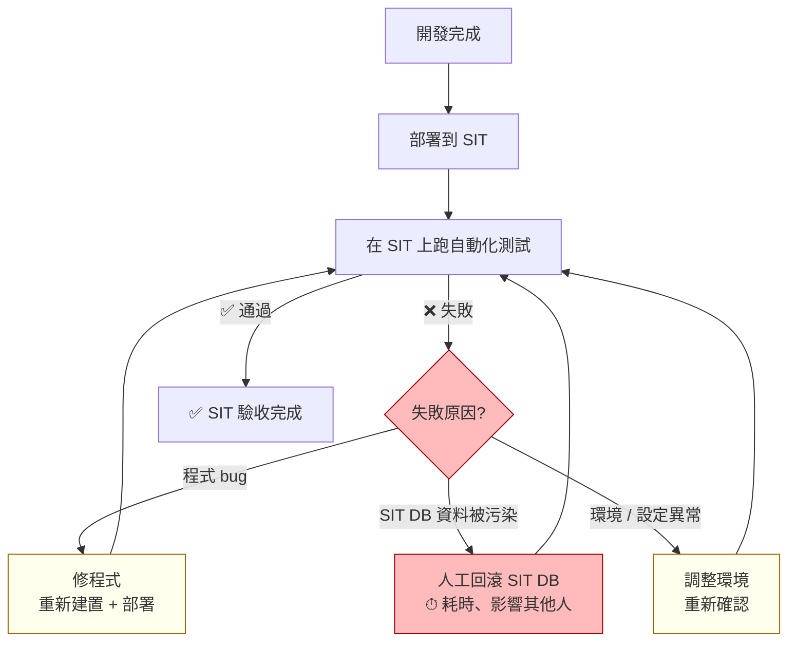

| 痛點 | 影響 |
|------|------|
| SIT DB 由多人共用，資料隨時被異動 | 同一版本今天過、明天不過；根因難定位 |
| 測試失敗無法區分：程式問題 vs 資料問題 vs 環境問題 | 排查時間長、來回部署消耗 |
| 回滾 SIT DB 需 DBA 介入 | 耗時且影響同時使用 SIT 的其他人 |
| 缺陷在部署到 SIT 後才被發現 | 修復成本高（已過 dev → CI → SIT 三層） |
| 驗證結果難以追溯 | 無法量化品質、無法產生客觀的上線決策依據 |

### 1.2 本教學的解法

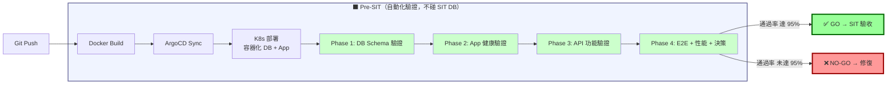

**四個關鍵移動**：

1. **資料庫容器化** — Postgres 跑在 K8s，InitContainer 每次重建 schema + 種子資料，做到「每次測試從同一狀態出發」
2. **BDD 業務語言** — Gherkin (zh-TW) 寫場景，BA/QA 可讀可寫；Step Definition 用 Java 實現，Developer 維護
3. **Pre-SIT phase 提前攔截** — 4 個獨立 Phase（DB→App→API→E2E）依序執行，前序失敗後序可選擇短路或續跑收集證據
4. **量化決策** — Cucumber 報告 → JSON 彙整 → 數字化 Go/No-Go 決策

---

## 2. 完整文件導覽

```mermaid
graph LR
    R[README.md<br/>本檔 - 教學入口]

    subgraph 規劃文件
        P1[Pre-SIT_Work_Plan_v2.md<br/>v2.0 原始版]
        P2[Pre-SIT_Work_Plan_v2.1.md<br/>v2.1 PoC 校準版]
        P3[Pre-SIT_Work_Plan_v2.2.md<br/>v2.2 雙環境架構 ⭐]
        P4[README.md §7<br/>功能延伸文件 ⭐⭐]
    end

    subgraph 教學文件
        G[Pre-SIT_Gherkin_to_Script_Guide.md<br/>Gherkin → Java 對應指南]
        DG[presit-bdd-demo/docs/guide.md<br/>demo 操作手冊]
    end

    subgraph PoC 實作
        PR[poc/POC_RESULTS.md<br/>v2.1 實跑結果 + 修正建議]
        K[poc/kind/up.sh<br/>環境啟動]
        SQL[poc/sql/<br/>DDL + DML]
        M[poc/manifests/<br/>K8s YAML]
        BDD[poc/bdd/<br/>BDD 專案]
        A[poc/argocd/<br/>Application]
        REP[poc/reports/<br/>cucumber 報告]
    end

    R -->|理解現行架構| P3
    P3 -.v2.3 延伸.-> P4
    R -->|理解語法| G
    R -->|實際操作| K
    P3 -.演進自.-> P2
    P2 -.演進自.-> P1
    P2 -.驗證來源.-> PR
    G -->|延伸閱讀| DG
    PR --> K
    PR --> SQL
    PR --> M
    PR --> BDD
    PR --> A
    PR --> REP

    style R fill:#fd9,stroke:#a60
    style P3 fill:#9cf,stroke:#069,stroke-width:3px
    style P2 fill:#cef
    style PR fill:#cfc
    style P4 fill:#9f9,stroke:#060,stroke-width:3px
```

| 文件 | 內容摘要 | 適合 |
|------|---------|------|
| **計畫書** | | |
| **[`Pre-SIT_Work_Plan_v2.2.md`](Pre-SIT_Work_Plan_v2.2.md)** ⭐ | 最新架構規格：雙環境、自行 build PetClinic、PostgreSQL + Flyway + Jenkins | PM、架構師、新成員 |
| [`Pre-SIT_Work_Plan_v2.1.md`](Pre-SIT_Work_Plan_v2.1.md) | v2.1 PoC 版（plan-faithful），已驗證 100% GO | 了解 v2.1 → v2.2 架構轉向 |
| [`Pre-SIT_Work_Plan_v2.md`](Pre-SIT_Work_Plan_v2.md) | v2.0 原始提案版 | 追溯設計決策根源 |
| **操作指南** | | |
| **`README.md`（本檔）** ⭐ | 全貌導覽；§3–§6 設計原理；§7.1–§7.12 環境建置、Jenkins CI/CD、Observability 等 | 所有角色 |
| **[`Pre-SIT_Gherkin_to_Script_Guide.md`](Pre-SIT_Gherkin_to_Script_Guide.md)** | Gherkin ↔ Java step 對應原理、手動契約說明、各 Phase 範例 | Developer、QA |
| [`presit-bdd-demo/docs/guide.md`](presit-bdd-demo/docs/guide.md) | v2.0 demo 操作手冊 | 對照舊版本 |
| **PoC 驗證** | | |
| **[`presit-bdd-demo/poc/POC_RESULTS.md`](presit-bdd-demo/poc/POC_RESULTS.md)** | v2.1 實跑成績、踩雷紀錄、修正建議 | 想確認可行性 |
| [`presit-bdd-demo/poc/`](presit-bdd-demo/poc/) | v2.1 可執行程式碼（BDD、K8s YAML、ArgoCD） | 動手跑或修改 |

### 2.1 依情境快速導向

| 情境 | 建議文件 |
|------|---------|
| 第一次接觸，快速了解全貌 | **README.md**（本檔） |
| 新組織導入、寫提案或報告 | **[v2.2](Pre-SIT_Work_Plan_v2.2.md)**（雙環境、完整 CI/CD） |
| 已有 v2.1 PoC，找升級路徑 | **v2.2 §10**「v2.1 → v2.2 變更對照」 |
| 了解 Jenkins CI/CD、Observability 等功能 | **README.md §7.5–§7.12** |
| 最少資源快速跑通 demo | **v2.1** + [`presit-bdd-demo/poc/`](presit-bdd-demo/poc/) |
| 學術 / 教學 / 了解設計演進 | v2.0 → v2.1 → v2.2 → v2.3（README §7） |

---

## 3. 核心設計原理

### 3.1 三層分離原則

```
業務語言層    Gherkin Feature        ← BA / QA 維護，純自然語言
                ↓ (cucumber.glue)
技術實現層    Step Definition Java   ← Developer 維護，JDBC / HTTP / kubectl
                ↓ (Maven Surefire)
執行環境層    JUnit 5 + K8s Job     ← DevOps 維護，CI/CD 整合
```

每一層只關心自己的事，**修改一層不影響另一層**：
- BA 改場景描述 → 不需動 Java
- Developer 換 ORM 工具 → 不需動 Gherkin
- DevOps 換 K8s 版本 → 不需動 step

### 3.2 Phase 依賴鏈（DAG）

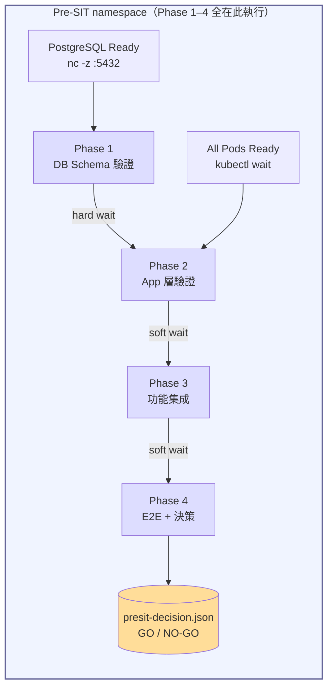

| 等待類型 | 寫法 | 行為 |
|---------|------|------|
| **hard wait** | `kubectl wait --for=condition=complete job/...` | 前序失敗則自身放棄 |
| **soft wait** | `kubectl wait --for=condition=complete job/... \|\| true` | 前序失敗仍繼續，便於一次 rerun 收齊證據 |

> 關鍵設計：Phase 3/4 的 initContainer 用 **soft wait**，使前序失敗時後序仍可執行，便於**一次 rerun 收集完整失敗證據**，避免反覆人工觸發。

### 3.3 兩個環境、兩個獨立資料庫

Pre-SIT 與 SIT 各自擁有獨立的 PostgreSQL StatefulSet，**完全不共用**：

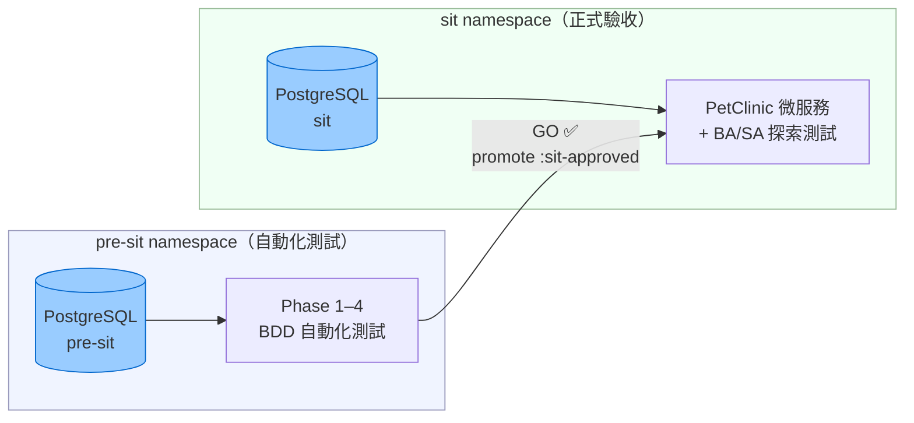

| | pre-sit PostgreSQL | sit PostgreSQL |
|---|---|---|
| **用途** | 自動化測試專用 | 正式 SIT 驗收 |
| **資料來源** | InitContainer 每次重建 schema + 種子資料 | 長期累積，BA/SA 手動維護 |
| **生命週期** | 每次 pipeline 執行前重啟，從已知狀態出發 | 持久保留，可用 snapshot/restore 管理 |
| **誰會寫入** | BDD Phase 1–4 自動測試 | BA/SA 探索測試、手動操作 |
| **與對方的關係** | 完全隔離，絕不碰 sit DB | 只在 promote 後被動接收新版 App |

**關鍵意義**：Pre-SIT 的測試無論跑幾次、失敗幾次，都不會影響 SIT 的資料狀態。BA/SA 在 SIT 環境的測試資料始終由自己掌控，不會因為自動化測試而被污染或意外重置。

### 3.4 Tag-based 場景分層

```
@pre-sit       ← 全部測試的 root tag
├── @phase-1   ← 跑 mvn test -P phase-1
├── @phase-2
├── @phase-3
├── @phase-4
├── @smoke         ← 冒煙快速回饋（2 分鐘）
├── @critical      ← critical path，任一失敗即 NO-GO
└── @known-issue   ← 已知 upstream 行為差異，CI 預設排除
```

組合篩選範例：
```bash
mvn test -Dcucumber.filter.tags="@phase-2 and @smoke"
mvn test -Dcucumber.filter.tags="@critical and not @known-issue"
```

### 3.5 Pre-SIT Promotion Gate：以容器化資料庫實現穩定的 CI 自動化驗證

Pre-SIT 是 CI Pipeline 內的 Promotion Gate，以 BDD 測試作為 Build Verification，通過後才允許將 artifact promote 進入 SIT 環境。

傳統做法是直接在 SIT 環境上跑測試，但 SIT 資料庫由多個角色共用，資料狀態隨時可能被測試人員、BA、SA 異動，導致自動化測試結果不穩定，失敗時也難以判斷是程式問題還是資料問題。更麻煩的是，一旦資料被改壞，就得人工回滾資料庫，拖慢整個流程。

Pre-SIT 的做法是在 CI 階段，為每一次 build 獨立啟動一套容器化資料庫，搭配 CI 工具（Argo Workflows）自動完成從環境初始化、BDD 測試執行到 Go/No-Go 決策的完整流程：

- **資料狀態可控**：容器資料庫每次從已知的初始狀態啟動，測試資料不受外部干擾，結果穩定可重複。
- **測試全自動、零人工介入**：Argo Workflows 依序執行 Phase 1–4，從 DB Schema 驗證到 E2E 決策，無需人工觸發或監看。
- **SIT 環境不受污染**：測試在獨立容器內完成，SIT 資料庫完全不被碰觸，BA/SA 的測試資料保持原狀。
- **不需回滾**：因為從未在 SIT 上跑自動化測試，就不存在「跑壞了要回滾」的問題。
- **BA/SA 時間用在刀口上**：自動化驗證交給 CI，BA/SA 進入 SIT 時直接面對已通過基線驗證的版本，可將精力集中在探索性測試、業務情境驗證等高價值工作。

只有當所有 BDD 測試通過、Phase 4 回傳 `"decision": "GO ✅"` 後，CI Pipeline 才允許將映像檔標記為 `:sit-approved` 並 promote 進 SIT，確保每一個進入正式測試環境的版本都是「有自動化證據支撐」的。

---

## 4. C4 模型架構圖

### 4.1 L1 — System Context（系統情境）

> 誰在用這個系統？它與外界如何互動？

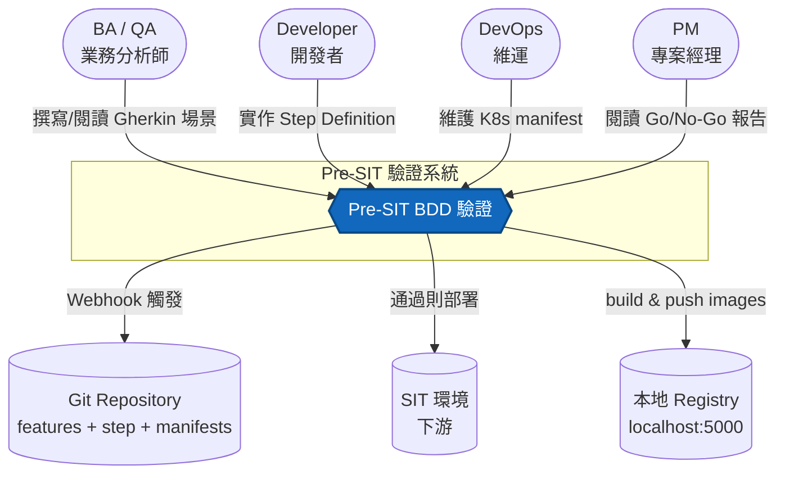

### 4.2 L2 — Container（容器）

> Pre-SIT 系統內部由哪些技術運行單元組成？


### 4.3 L3 — Component（元件）

> 「BDD Runner」這個 container 內部由哪些程式元件組成？

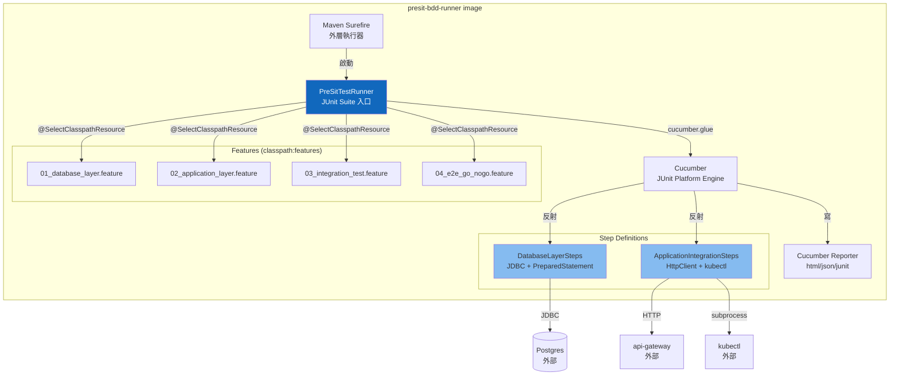

### 4.4 L4 — Code（程式碼層）

> 一個 Gherkin step 如何對應到一行 Java assertion？

以「Phase 1 場景 4：所有業務表的主鍵約束正確」為例：

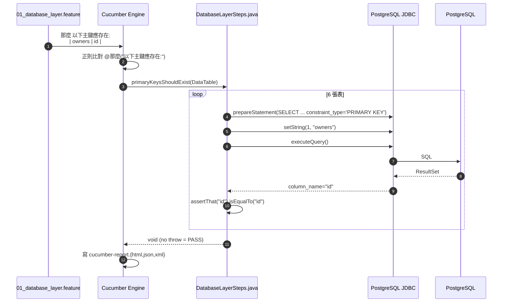

---

## 5. Phase 1–4 執行序列圖

### 5.1 整體 CI/CD 流程

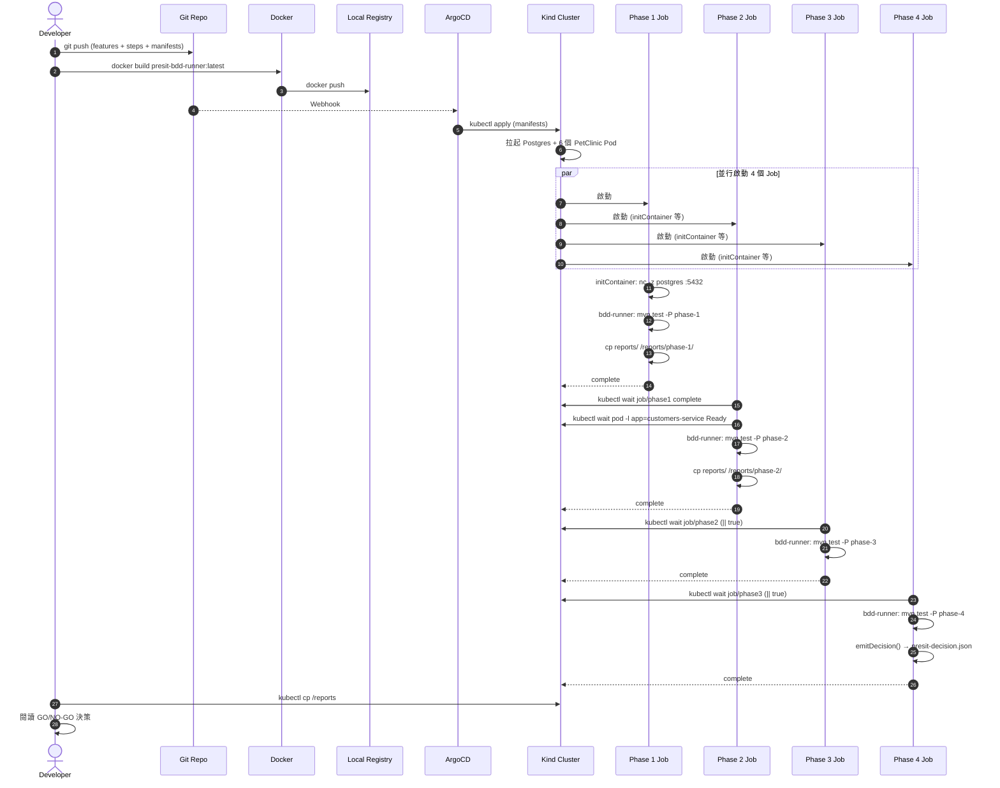

### 5.2 Phase 1：DB Schema 驗證內部流程

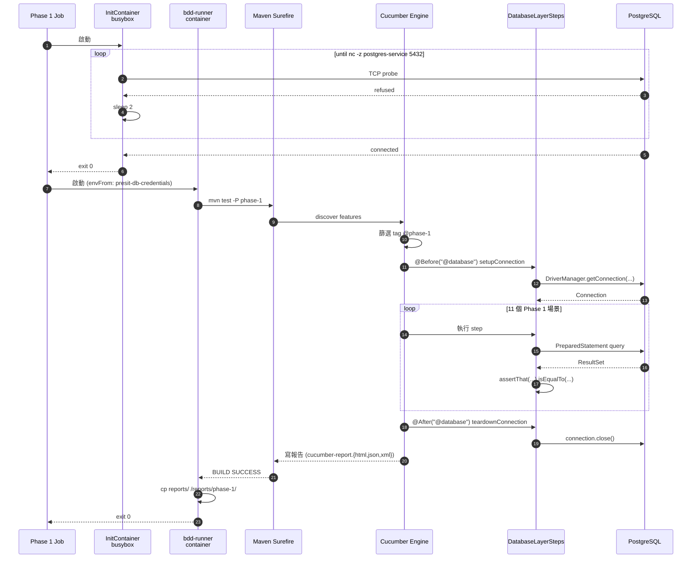

### 5.3 Phase 4：Go/No-Go 決策算法

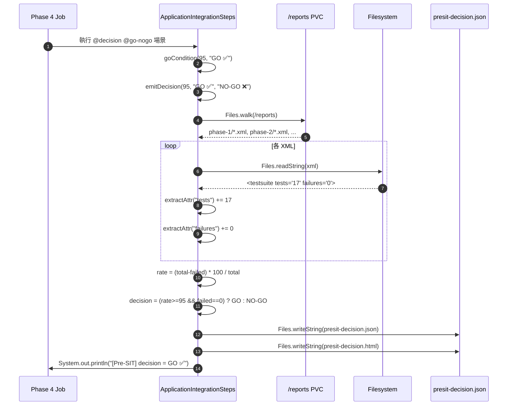

---

## 6. BDD 框架類別圖

### 6.1 測試專案類別結構

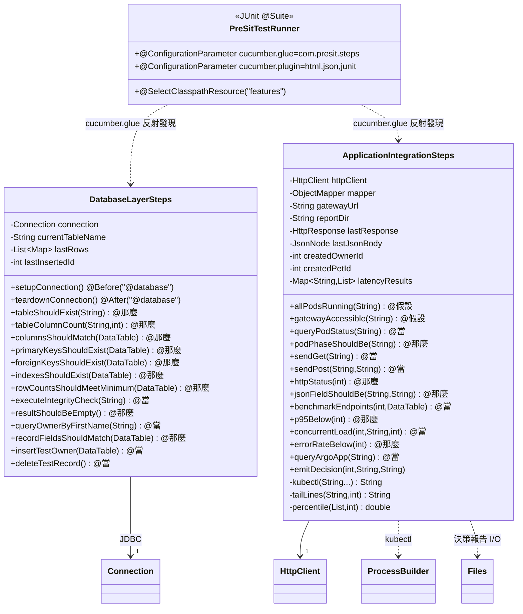

### 6.2 Cucumber Engine 與 Step 的綁定機制


### 6.3 K8s Job 物件關係

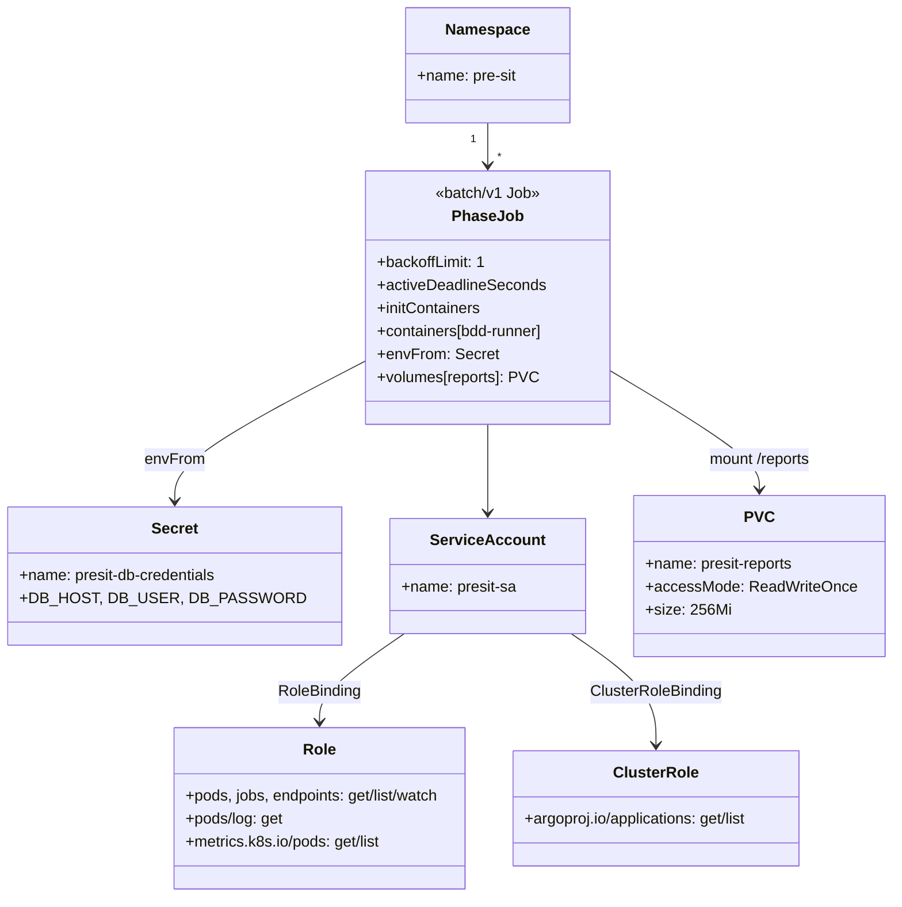

---


## 7. Quick Start（從零跑起 PoC）

### 7.1 先決條件

| 工具 | 版本 | 用途 |
|------|------|------|
| Docker | 20+ | 容器執行時 |
| Kind | 0.24+ | 本地 K8s |
| kubectl | 1.28+ | K8s CLI |
| Java | 17+ | BDD 編譯 |
| Maven | 3.9+ | 依賴管理 |
| Helm | 3.x | Monitoring / Sealed Secrets 安裝（v2.3 必要） |
| kubeseal | 0.36+ | Sealed Secrets 加密 CLI（v2.3 必要） |
| envsubst | gettext | Per-user namespace 模板展開（v2.3 必要） |

驗證：
```bash
for c in docker kind kubectl java mvn helm kubeseal envsubst; do
  printf "%-12s " $c; $c --version 2>&1 | head -1
done
```

kubeseal 安裝（若尚未安裝）：
```bash
KUBESEAL_VERSION=0.36.6
curl -sL "https://github.com/bitnami-labs/sealed-secrets/releases/download/v${KUBESEAL_VERSION}/kubeseal-${KUBESEAL_VERSION}-linux-amd64.tar.gz" \
  | tar -xz kubeseal && install -m 755 kubeseal ~/.local/bin/kubeseal
export PATH="$HOME/.local/bin:$PATH"
```

### 7.2 五個指令跑完整 PoC

```bash
# 1) Kind 集群 + 本地 registry
./presit-bdd-demo/poc/kind/up.sh

# 2) ArgoCD
kubectl create namespace argocd
kubectl apply -n argocd -f https://raw.githubusercontent.com/argoproj/argo-cd/v2.13.1/manifests/install.yaml
kubectl -n argocd wait --for=condition=Available deployment --all --timeout=300s

# 3) 部署 Postgres + 6 個 PetClinic 服務
kubectl apply -f presit-bdd-demo/poc/manifests/00-namespace.yaml
kubectl -n pre-sit create configmap postgres-init-scripts \
  --from-file=presit-bdd-demo/poc/sql/01-schema.sql \
  --from-file=presit-bdd-demo/poc/sql/02-sample-data.sql
kubectl apply -f presit-bdd-demo/poc/manifests/10-postgres.yaml \
              -f presit-bdd-demo/poc/manifests/20-config-server.yaml \
              -f presit-bdd-demo/poc/manifests/30-discovery-server.yaml \
              -f presit-bdd-demo/poc/manifests/40-microservices.yaml

# 4) 編譯並推 BDD runner image
(cd presit-bdd-demo/poc/bdd && \
   docker build -t localhost:5000/presit-bdd-runner:latest . && \
   docker push localhost:5000/presit-bdd-runner:latest)

# 5) 跑 4 Phase Jobs
kubectl apply -f presit-bdd-demo/poc/manifests/50-presit-jobs.yaml
kubectl get jobs -n pre-sit -l app=presit-validation -w
```

### 7.3 取出決策報告

```bash
# 起一個 sidecar pod 把 PVC 拉出來
kubectl run report-fetcher -n pre-sit --image=busybox:1.36 \
  --overrides='{"spec":{"containers":[{"name":"c","image":"busybox","command":["sleep","600"],"volumeMounts":[{"name":"r","mountPath":"/reports"}]}],"volumes":[{"name":"r","persistentVolumeClaim":{"claimName":"presit-reports"}}]}}'
kubectl wait pod/report-fetcher -n pre-sit --for=condition=Ready --timeout=60s
kubectl cp pre-sit/report-fetcher:/reports ./local-reports
cat local-reports/presit-decision.json
xdg-open local-reports/phase-1/cucumber-report.html
```

### 7.4 本機快速迭代（不過 K8s）

```bash
cd presit-bdd-demo/poc/bdd
kubectl -n pre-sit port-forward svc/postgres-service 15432:5432 &
kubectl -n pre-sit port-forward svc/api-gateway     18080:8080 &
DB_HOST=localhost DB_PORT=15432 \
GATEWAY_URL=http://localhost:18080 \
REPORT_DIR=$(pwd)/reports \
mvn test -P phase-1   # 或 phase-2 / phase-3 / phase-4
```

### 7.5 Stage C：Jenkins CI/CD 自動化 （在 Kind 內）

Jenkins 作為 Pre-SIT 的 CI/CD orchestrator，部署在同一個 Kind 叢集，透過 kubectl（in-cluster）觸發 BDD 鏈並讀取決策。

#### 前提：v2.2 雙環境已就緒

```bash
# 確認 ArgoCD 兩個 Application 存在
kubectl -n argocd get application petclinic-pre-sit petclinic-sit
# 確認 pre-sit namespace 有 BDD RBAC（一次性 setup）
kubectl apply -f manifests/pre-sit/25-presit-sa.yaml
```

#### 啟動 Jenkins

```bash
# 部署 Jenkins（含 ServiceAccount + RBAC）
kubectl apply -f manifests/jenkins/00-namespace.yaml
kubectl apply -f manifests/jenkins/05-rbac.yaml
kubectl apply -f manifests/jenkins/10-jenkins.yaml

# 等待就緒（initContainer 安裝 kubectl + plugins 約需 2–3 分鐘）
kubectl wait -n jenkins deployment/jenkins \
  --for=condition=Available --timeout=300s
```

#### 觸發 Pipeline

> **帳密**：Jenkins 採用 `JENKINS_OPTS="--argumentsRealm.passwd.admin= --argumentsRealm.roles.admin=admin"` 設定，**無需帳號密碼**，直接開啟 UI 即可操作。CSRF 保護亦已停用，方便 curl / API 觸發。

```bash
# 從 Ingress 進入 Jenkins UI（無密碼）
# 先加入 /etc/hosts：echo "127.0.0.1 jenkins.local" | sudo tee -a /etc/hosts
echo "Jenkins UI: http://jenkins.local:30080"

# 或用 API 直接觸發（CSRF 已停用）
kubectl exec -n jenkins deploy/jenkins -- \
  curl -s -X POST http://localhost:8080/job/petclinic-presit/build
```

#### Pipeline 階段說明

| 階段 | 動作 | 預期輸出 |
|------|------|---------|
| Preflight | 驗 kubectl 可用、namespace 存在、ArgoCD apps 存在 | `kubectl v1.36+` |
| Reset Pre-SIT | 清舊 jobs/PVC、重啟 postgres + deployments | `pod/postgres-0 condition met` |
| Apply BDD Jobs | `kubectl apply manifests/pre-sit/30-bdd-jobs.yaml` | 4 jobs created |
| Wait Phase 1-4 | Polling 每 15 秒檢查 phase4 condition（支援 K8s 1.29+ `SuccessCriteriaMet`） | `Phase 4 done: SuccessCriteriaMet Complete` |
| Read decision | 讀 phase4 logs，解析 JSON | `"decision":"GO ✅"` |
| Check SIT state | 顯示 SIT 4 個 deployment 的現行 image | `:sit-approved` |

#### 已知限制（v2.4 backlog）

- Jenkins 無法收到 GitHub webhook（Kind 不對外）→ 手動觸發或 polling SCM
- Image build（mvn package + docker build/push）留給 v2.4 用 kaniko 或 DinD sidecar

### 7.6 Observability：Prometheus + Grafana + Loki

集中觀測 pre-sit 和 SIT 兩個環境的 metrics 與 logs，無需 kubectl exec 就能看到服務健康狀態。

#### 元件

| 元件 | 用途 | 安裝方式 |
|------|------|---------|
| Prometheus | 抓取所有 PetClinic `/actuator/prometheus` metrics | kube-prometheus-stack Helm |
| Grafana | 視覺化儀表板 | kube-prometheus-stack Helm（Ingress: grafana.local） |
| Loki | log 聚合（pre-sit / sit / jenkins / bdd runner） | grafana/loki-stack Helm |
| Promtail | 各 pod log 收集 DaemonSet | grafana/loki-stack Helm |

#### 一鍵安裝

```bash
bash scripts/setup-monitoring.sh
```

或分步驟：

```bash
helm upgrade --install kube-prometheus prometheus-community/kube-prometheus-stack \
  --namespace monitoring \
  --values manifests/monitoring/values-kube-prometheus.yaml \
  --set grafana.sidecar.dashboards.enabled=true \
  --set grafana.sidecar.dashboards.label=grafana_dashboard \
  --wait

helm upgrade --install loki grafana/loki-stack \
  --namespace monitoring \
  --values manifests/monitoring/values-loki.yaml \
  --wait

kubectl apply -f manifests/monitoring/10-servicemonitors.yaml
kubectl apply -f manifests/monitoring/20-dashboards.yaml
```

> **Kind 注意**：需先提高 inotify 限制（Promtail DaemonSet 需要）：
> ```bash
> docker exec presit-control-plane sysctl -w \
>   fs.inotify.max_user_instances=512 \
>   fs.inotify.max_user_watches=524288
> ```

#### 訪問 Grafana

```
http://grafana.local:30080    帳號: admin  密碼: presit-admin
# （需先加入 /etc/hosts：echo "127.0.0.1 grafana.local" | sudo tee -a /etc/hosts）
```

內建兩個 Dashboard：
- **Pre-SIT Pipeline Overview** — HTTP request rate、P95 latency、JVM heap、5xx error rate（pre-sit + SIT 對比）
- **Pre-SIT / SIT Logs (Loki)** — 三個 log panel：pre-sit、SIT、BDD runner jobs

#### 驗收指標

```bash
# 確認 8 個 PetClinic 服務都被 Prometheus 抓到
kubectl port-forward -n monitoring svc/kube-prometheus-kube-prome-prometheus 9090:9090 &
curl -s 'http://localhost:9090/api/v1/targets?state=active' | \
  python3 -c "
import sys,json; d=json.load(sys.stdin)
t=[x for x in d['data']['activeTargets'] if x['labels'].get('namespace') in ('pre-sit','sit')]
print(f'{sum(1 for x in t if x[\"health\"]==\"up\")}/{len(t)} petclinic targets up')
"
# 預期輸出: 8/8 petclinic targets up
```

### 7.7 Sealed Secrets：消除 Git 明文密碼

`manifests/pre-sit/05-config.yaml` 和 `manifests/sit/05-config.yaml` 原先直接包含明文 `POSTGRES_PASSWORD`。v2.3 改用 Bitnami Sealed Secrets，讓密碼以非對稱加密後的密文存入 Git，只有 cluster 內的 controller 能解封。

#### 元件

| 元件 | 用途 |
|------|------|
| `sealed-secrets-controller` | kube-system namespace，持有私鑰，負責解封 SealedSecret → Secret |
| `kubeseal` CLI | 用 controller 公鑰把明文 Secret 加密成 SealedSecret |

#### 一鍵安裝

```bash
bash scripts/setup-sealed-secrets.sh
```

或手動：

```bash
# 安裝 controller
helm upgrade --install sealed-secrets sealed-secrets/sealed-secrets \
  --namespace kube-system --values manifests/sealed-secrets/values.yaml --wait

# 套用 SealedSecrets（ArgoCD 管理 sit；pre-sit 手動 apply）
kubectl apply -f manifests/pre-sit/06-sealed-db-credentials.yaml
# sit 由 ArgoCD petclinic-sit 自動 sync（kustomization 已含此檔）
```

> **kubeseal 安裝**（若尚未安裝）：
> ```bash
> KUBESEAL_VERSION=0.36.6
> curl -sL "https://github.com/bitnami-labs/sealed-secrets/releases/download/v${KUBESEAL_VERSION}/kubeseal-${KUBESEAL_VERSION}-linux-amd64.tar.gz" \
>   | tar -xz kubeseal && install -m 755 kubeseal ~/.local/bin/kubeseal
> ```

#### 封存新 Secret

```bash
export PATH="$HOME/.local/bin:$PATH"

kubectl create secret generic my-secret -n pre-sit \
  --from-literal=KEY=VALUE \
  --dry-run=client -o yaml \
  | kubeseal \
      --controller-name=sealed-secrets-controller \
      --controller-namespace=kube-system \
      --format yaml > manifests/pre-sit/06-my-secret.yaml

# 把輸出的 SealedSecret 加入 git — 明文不會進 repo
```

#### 驗收

```bash
# SealedSecrets 狀態
kubectl get sealedsecret -A
# 預期: pre-sit 和 sit 各一個，SYNCED=True

# 解封後的 Secret 值確認
kubectl get secret petclinic-db-credentials -n pre-sit \
  -o jsonpath='{.data.POSTGRES_USER}' | base64 -d
# 預期: petclinic
```

### 7.8 Per-user SIT Namespace：每位測試人員獨立沙盒

> **這是 SIT（System Integration Testing）環境的功能，不是 Pre-SIT。**
> Pre-SIT 由自動化 BDD 管道驗證，通過後的版本才 promote 到 SIT。
> SIT 環境供 BA／SA／測試人員**手動探索性測試**，每人擁有完整獨立的應用程式與資料庫。

#### 解決的問題

傳統做法只有一個共用 SIT namespace，多人同時測試時會互相干擾：

| 情境 | 共用 SIT 的問題 |
|------|----------------|
| Alice 新增寵物 Owner → Bob 的清單被改變 | 測試資料互相污染，難以重現 Bug |
| Alice 執行壓力測試或批次資料灌入 | 影響 Bob 的 API 回應時間與資料正確性 |
| 測試完需要重置為乾淨狀態 | 誰要重置？重置後影響所有人 |
| 兩人同時測試不同版本的功能 | 同一 namespace 只能跑同一套 image |

v2.3 為每位測試人員建立**完全隔離的 SIT 沙盒**：獨立 Postgres、獨立 PetClinic 服務、獨立 Ingress host，彼此完全不干擾。

#### 設計原則

| 決策 | 理由 |
|------|------|
| namespace = `sit-<username>` | K8s namespace 是最便宜的隔離邊界 |
| 每個 namespace 獨立封存 SealedSecret | Bitnami Sealed Secrets 是 namespace-scoped，同一明文在不同 namespace 有不同密文 |
| Ingress host = `<username>-sit.local` | nginx-ingress 依 Host header 路由，不需額外 port |
| Kustomize overlay per user | 共用 base + overlay patches，GitOps-native，無 Helm 依賴 |
| ArgoCD ApplicationSet + git directory generator | 掃描 `manifests/sit-users/*/`，每個子目錄自動建立 Application |
| 刪除即清理 | 從 git 移除目錄 → ArgoCD 刪除 Application（finalizer 確保 K8s 資源含 PVC 也被清理） |

#### 兩種模式

**直接模式**（快速，不需 git push）
```bash
# 建立 sit-alice
scripts/create-sit-user.sh alice

# 指定 image tag（預設 v2.2）
scripts/create-sit-user.sh alice v2.3

# 刪除
scripts/delete-sit-user.sh alice
```

**GitOps 模式**（生成 overlay → push → ArgoCD 自動 sync）
```bash
# 建立 sit-bob：生成 manifests/sit-users/bob/，commit + push，ArgoCD 接管
scripts/create-sit-user.sh --gitops bob

# 刪除：從 git 移除 bob/ 目錄，ArgoCD 自動刪除 Application + namespace
scripts/delete-sit-user.sh --gitops bob
```

#### GitOps 流程

```
create-sit-user.sh --gitops bob
  ↓
manifests/sit-users/bob/
  ├── 00-namespace.yaml               (sit-bob namespace + labels)
  ├── 06-sealed-db-credentials.yaml   (kubeseal 封存，namespace-scoped)
  └── kustomization.yaml              (namespace: sit-bob, patches, images)
  ↓ git push
ArgoCD ApplicationSet (git directory generator)
  ↓ 掃描到 manifests/sit-users/bob/
建立 Application petclinic-sit-bob
  ↓ automated sync
Kustomize build (overlay → base)
  ↓
K8s 資源建立在 sit-bob namespace
```

#### 存取方式

```bash
echo '127.0.0.1 bob-sit.local' | sudo tee -a /etc/hosts
curl -s -H 'Host: bob-sit.local' http://localhost:30080/api/customer/owners | jq length
# 預期: 10（Flyway 初始測試資料）
```

瀏覽器開啟：**`http://bob-sit.local:30080`** → 看到 PetClinic UI，資料完全屬於 Bob，不受其他人影響。

#### 測試人員實際工作流程

以 Alice 為例，從收到測試任務到開始測試：

```
1. 管理員執行：scripts/create-sit-user.sh alice
   → sit-alice namespace 建立，含獨立 Postgres + PetClinic 服務

2. Alice 的 /etc/hosts 新增一行：
   echo '127.0.0.1 alice-sit.local' | sudo tee -a /etc/hosts

3. 開啟瀏覽器 http://alice-sit.local:30080
   → 看到 PetClinic 初始資料（10 筆 owner，Flyway 載入）

4. Alice 自由測試：
   - 新增 / 修改 / 刪除 Owner、Pet、Visit
   - 測試 API 呼叫（Swagger / Postman）
   - 驗證 Bug Fix 是否生效
   → 所有操作只影響 sit-alice namespace，Bob / Carol 的環境完全不受影響

5. 需要重置乾淨資料時：
   scripts/delete-sit-user.sh alice && scripts/create-sit-user.sh alice
   → 30 秒後 sit-alice 回到 Flyway 初始狀態

6. 測試結束，管理員清理：
   scripts/delete-sit-user.sh alice
   → namespace + PVC + Ingress 全部刪除
```

#### 多人並行測試

團隊可以為每位測試人員各建一個沙盒，各自獨立：

```bash
scripts/create-sit-user.sh alice
scripts/create-sit-user.sh bob
scripts/create-sit-user.sh carol
```

| 測試人員 | 存取 URL | Postgres | 資料狀態 |
|---------|---------|---------|---------|
| Alice | `http://alice-sit.local:30080` | `sit-alice` namespace 獨立 | 各自獨立 |
| Bob | `http://bob-sit.local:30080` | `sit-bob` namespace 獨立 | 各自獨立 |
| Carol | `http://carol-sit.local:30080` | `sit-carol` namespace 獨立 | 各自獨立 |

三人同時測試、同時修改資料，互不干擾。

#### 與共用 SIT 的比較

| | 共用 SIT（傳統） | Per-user SIT（v2.3） |
|--|----------------|---------------------|
| 資料隔離 | ❌ 互相污染 | ✅ 完全隔離 |
| 並行測試 | ❌ 互相等待 | ✅ 各自獨立進行 |
| 環境重置 | ❌ 影響所有人 | ✅ 只重置自己的沙盒 |
| 建立成本 | — | ✅ 一行指令，約 30 秒 |
| 資源使用 | 1 套 Postgres + PetClinic | N 套（每人一套），資源需求等比 |

> **建議**：SIT 環境資源有限時，測試完成即刪除（`delete-sit-user.sh`），需要時再重建，不需常駐。

#### 檔案結構

```
manifests/
├── sit-user-base/               Kustomize base（無 namespace，被 overlay 繼承）
│   ├── kustomization.yaml
│   ├── 05-config.yaml
│   ├── 10-postgres.yaml
│   ├── 20-petclinic-services.yaml
│   └── 30-ingress.yaml
├── sit-users/                   每位使用者的 Kustomize overlay（git-tracked）
│   └── bob/
│       ├── 00-namespace.yaml
│       ├── 06-sealed-db-credentials.yaml
│       └── kustomization.yaml
└── argocd/
    └── appset-sit-users.yaml    ApplicationSet (git directory generator)
```

---

### 7.9 完整環境 Quick Start

v2.1/v2.2 的 §7.2「五個指令」只建立 Pre-SIT PoC。本節提供 **v2.3 全棧 Quick Start**：從 Kind 空叢集到 Jenkins + Observability + Sealed Secrets + Per-user SIT 全部就緒，一個腳本搞定。

#### 一鍵全棧安裝

```bash
# clone repo（若尚未 clone）
git clone https://github.com/ChunPingWang/pre-site-tutorial.git
cd pre-site-tutorial

# 全棧安裝（Step 1–9，含 PetClinic image build，約 10–15 分鐘）
bash scripts/setup-v23.sh

# 若 PetClinic image 已存在於 localhost:5000，跳過 build：
bash scripts/setup-v23.sh --skip-build
```

#### 安裝順序（setup-v23.sh 內部步驟）

```
Step 1/9  Kind 叢集 + 本地 registry     presit-bdd-demo/poc/kind/up.sh（冪等）
Step 2/9  nginx-ingress                  NodePort :30080（HTTP）/ :31485（HTTPS）
Step 3/9  ArgoCD                         v2.13.1，等待所有 deployment Available
Step 4/9  PetClinic image build + push   4 服務 + BDD runner，tag :v2.2
Step 5/9  Sealed Secrets                 controller + SealedSecrets（pre-sit / sit）
Step 6/9  pre-sit RBAC                   BDD runner SA/Role/RoleBinding（一次性）
Step 7/9  ArgoCD Applications            app-pre-sit + app-sit + appset-sit-users
Step 8/9  Jenkins                        2.492.3-lts，Ingress: jenkins.local
Step 9/9  Observability                  Prometheus + Grafana(grafana.local) + Loki + Promtail
```

> **Kind inotify 限制**：Step 9 會自動執行
> `docker exec presit-control-plane sysctl -w fs.inotify.max_user_instances=512 fs.inotify.max_user_watches=524288`
> 確保 Promtail DaemonSet 不 CrashLoop。每次 Kind 叢集重啟後需重跑 Step 9 或手動執行此指令。

#### 安裝後驗收

```bash
NODE_IP=$(kubectl get node -o jsonpath='{.items[0].status.addresses[?(@.type=="InternalIP")].address}')

# 1. ArgoCD Applications 狀態
kubectl get application -n argocd
# 預期：petclinic-pre-sit (OutOfSync/Healthy)  petclinic-sit (Synced/Healthy)

# 2. SIT API 可用
curl -s -H 'Host: sit.local' http://localhost:30080/api/customer/owners | python3 -c \
  "import sys,json; print(f'{len(json.load(sys.stdin))} owners')"
# 預期：10 owners

# 3. Jenkins 可到達
curl -s -o /dev/null -w "%{http_code}" -H "Host: jenkins.local" http://localhost:30080/
# 預期：200 或 403

# 4. Prometheus targets
kubectl -n monitoring port-forward svc/kube-prometheus-kube-prome-prometheus 9090:9090 &
sleep 3
curl -s 'http://localhost:9090/api/v1/targets?state=active' | python3 -c "
import sys,json; d=json.load(sys.stdin)
t=[x for x in d['data']['activeTargets'] if x['labels'].get('namespace') in ('pre-sit','sit')]
print(f'{sum(1 for x in t if x[\"health\"]==\"up\")}/{len(t)} petclinic targets up')
"
# 預期：8/8 petclinic targets up

# 5. Sealed Secrets 解封
kubectl get sealedsecret -A
# 預期：pre-sit 和 sit 各一個
```

#### 存取 URL 總表

所有服務統一透過 nginx-ingress（NodePort **:30080**）對外，不需記多個 port：

| 服務 | URL | 帳密 |
|------|-----|------|
| SIT PetClinic UI | `http://sit.local:30080/` | — |
| Jenkins | `http://jenkins.local:30080/` | 無密碼 |
| Grafana | `http://grafana.local:30080/` | admin / presit-admin |
| ArgoCD UI | `http://argocd.local:30080/` | admin / 見下方指令 |
| Per-user SIT | `http://<username>-sit.local:30080/` | — |

ArgoCD 初始密碼：
```bash
kubectl -n argocd get secret argocd-initial-admin-secret \
  -o jsonpath='{.data.password}' | base64 -d && echo
```

/etc/hosts（一次加入所有 host）：
```bash
sudo tee -a /etc/hosts <<'EOF'
127.0.0.1 sit.local jenkins.local grafana.local argocd.local
EOF
```

#### 下一步

```bash
# A. 觸發第一次 Jenkins pipeline
kubectl exec -n jenkins deploy/jenkins -- \
  curl -s -X POST http://localhost:8080/job/petclinic-presit/build
kubectl logs -n jenkins deploy/jenkins -f 2>/dev/null | grep "Finished\|stage\|error" | head -20

# B. 建立個人 SIT namespace（GitOps 模式）
scripts/create-sit-user.sh --gitops alice
echo "127.0.0.1 alice-sit.local" | sudo tee -a /etc/hosts
# 3 分鐘後 ArgoCD 自動 sync：
kubectl get application petclinic-sit-alice -n argocd -w

# C. 建立個人 SIT namespace（直接模式，不需 git push）
scripts/create-sit-user.sh alice
```

---

### 7.10 Postgres PVC Snapshot / Restore

SIT 資料會隨測試累積。快照功能讓測試人員在「已知良好狀態」做完快照，測試後隨時還原，不需重建整個 namespace。

#### 設計

| 決策 | 理由 |
|------|------|
| pg_dump / pg_restore（非 VolumeSnapshot） | Kind 的 `local-path` provisioner 不支援 CSI VolumeSnapshot；pg_dump 在任何 K8s 環境都能用 |
| Custom format（`-Fc`） | 支援壓縮，可 parallel restore，比 SQL text dump 小 |
| 快照存入獨立 PVC（`postgres-snapshots`, 5Gi） | 與資料 PVC 分離，namespace 刪除不會連帶清除快照（需手動刪 PVC） |
| Restore 前先 scale down | 避免還原時 PetClinic 服務持有 DB 連線導致 `pg_restore` 失敗 |

適用 namespace：`sit`、`sit-<username>`（不適用 `pre-sit`，pre-sit 每次都自動 reset）

#### 使用方式

```bash
# 建立快照（自動以時間戳命名）
scripts/snapshot-db.sh sit
scripts/snapshot-db.sh sit-bob

# 列出現有快照
scripts/snapshot-db.sh sit --list

# 還原（scale down → pg_restore → scale up）
scripts/restore-db.sh sit 20260516-233303-sit
scripts/restore-db.sh sit-bob 20260516-233303-sit-bob
```

#### 執行流程

**快照（`snapshot-db.sh`）**：
1. 確認 `postgres-snapshots` PVC 存在（不存在則建立 5Gi PVC）
2. 建立 `pg-snapshot-<name>` Job，執行 `pg_dump -Fc`
3. 等待 Job Complete，印出快照檔大小

**還原（`restore-db.sh`）**：
1. Scale down：customers / vets / visits / api-gateway → 0 replicas
2. 建立 `pg-restore-<name>` Job，執行 `pg_restore --clean --if-exists`
3. Scale up 4 個服務 → 等待 pods Ready

#### 驗收範例

```bash
# 建立快照
scripts/snapshot-db.sh sit
# 輸出: ✅ 完成：20260516-233303-sit.dump（24.0K）

# 模擬資料變動（手動在 UI 新增一隻 pet）

# 還原至快照狀態
scripts/restore-db.sh sit 20260516-233303-sit
# 輸出: ✅ 還原完成

# 確認資料還原
curl -s -H 'Host: sit.local' http://localhost:30080/api/customer/owners | jq length
# 預期: 10（還原前新增的 pet 已消失）
```

---

### 7.11 Jenkins vs Argo Workflows：架構對比

> **Branch 策略**：本分支（`v2.3-jenkins`）使用 Jenkins 作為 CI/CD orchestrator；`main` 分支改用 Argo Workflows。兩者達到相同的 pipeline 目標，架構設計不同。

#### 架構對比

| 面向 | Jenkins（本分支）| Argo Workflows（main 分支）|
|------|-----------------|--------------------------|
| 部署方式 | Deployment + ClusterIP | Helm chart（argo-workflows）|
| Pipeline 定義 | `Jenkinsfile`（Groovy DSL）| `WorkflowTemplate`（YAML CRD）|
| 觸發方式 | UI / curl API（CSRF 停用）| UI / argo CLI / kubectl |
| K8s 整合 | `kubectl exec` in-cluster | 原生 `resource` template |
| 認證 | 無密碼 admin（PoC 用）| Server 模式（無需登入，PoC 用）|
| 資源佔用 | ~500 MB | ~200 MB |
| Kubernetes-native | 否（額外維護 Jenkins controller）| 是（CRD-driven，無外部依賴）|

#### 選用 Jenkins 的教學目的

本分支存在的理由：**大多數企業已有 Jenkins 基礎建設**，不一定能立即換成 Argo Workflows。此分支展示在現有 Jenkins 環境下，如何以最小改動接入 Pre-SIT BDD Pipeline，作為**漸進式導入路線**的參考。

- 企業已有 Jenkins → 以本分支為起點，逐步補足 Observability / Sealed Secrets
- 綠地新專案 → 建議直接使用 `main`（Argo Workflows，資源更輕、更 K8s-native）

#### Pipeline 結構對應（Jenkinsfile Stage ↔ Argo Step）

| 順序 | Jenkins Stage | Argo WorkflowTemplate Step | 說明 |
|------|--------------|---------------------------|------|
| 1 | `Preflight` | `preflight` | 環境前置驗證 |
| 2 | `Reset Pre-SIT` | `reset-presit` | 清舊 Job/PVC，重啟 Postgres |
| 3 | `Apply BDD Jobs` | `apply-bdd-jobs` | `kubectl apply 30-bdd-jobs.yaml` |
| 4 | `Wait Phase 1–4` | `wait-phase4` | Polling Phase 4 Job 狀態 |
| 5 | `Read Decision` | `read-decision` | 解析 Phase 4 logs GO/NO-GO |
| 6 | `Check SIT State` | `check-sit-state` | 顯示 SIT Deployment image |

Jenkins Pipeline 詳細安裝與操作說明見 [§7.5](#75-stage-cjenkins-cicd-自動化-在-kind-內)；Argo Workflows 版本見 `main` 分支 [§7.11](https://github.com/ChunPingWang/pre-site-tutorial/blob/main/README.md#711-argo-workflows取代-jenkins)。

---

### 7.12 Gherkin Editor：瀏覽器管理測試案例

提供 Web UI，讓測試人員不需命令列即可：
- **瀏覽 / 新增 / 編輯 / 刪除** `.feature` 檔案，修改後自動 commit + push 回 GitHub
- **匯出 / 匯入** `.feature` 檔案（本機下載 / 上傳並自動 push）
- **紅/綠燈** 顯示各 Scenario 與 Phase 的最新測試結果（讀取 cucumber-report.json）
- **個別執行** 各 Phase 的 BDD 測試，不需觸發完整 Pipeline
- **批次執行** Pre-SIT 全流程 Pipeline
- **產生綜合報告** 含各 Scenario 結果與 DB 資料表查詢（HTML 可下載）
- **清除重置** 一鍵刪除測試 Jobs、清除 cucumber 報告，並重建 Postgres 資料庫（含 DDL/DML 測試資料）與 PetClinic 服務

#### 前提

- Kind presit 叢集已就緒（`bash scripts/setup-v23.sh` 已執行）
- GitHub Personal Access Token（需有 `repo` scope）

#### 安裝

```bash
# 設定 GitHub Token（需有 repo scope）
export GITHUB_TOKEN="ghp_xxxxxxxxxxxx"

# 一鍵安裝（build image → 建立 Secret → 套用 manifests）
bash scripts/setup-presit-editor.sh

# 加入 /etc/hosts（一次性）
echo "127.0.0.1 presit-editor.local" | sudo tee -a /etc/hosts
```

安裝完成後訪問：**http://presit-editor.local:30080**

#### 介面說明

```
┌──────────────────────────────────────────────────────────────────────────┐
│  🧪 Pre-SIT Gherkin Editor  [🔄 清除重置] [📊 產生報告] [▶ Run Pipeline] │
├───────────────────────┬──────────────────────────────────────────────────┤
│ Feature 檔案           │  [編輯] [測試結果]  tab                   │
│ [📥 匯入]  [+ 新增]    │                                          │
│                       │  編輯模式：                               │
│ ⚫ database/ [▶ 執行] │    Gherkin 原始文字（可直接修改）               │
│   🟢 01_database...   │    [⬇ 匯出]  [🗑 刪除]  [💾 儲存並推送]       │
│   🔴 02_api...        │                                              │
│                       │  測試結果模式：                               │
│ 🟢 application/[▶ 執行]│   🟢 Scenario 名稱  (12 ms)                │
│   🟢 01_app...        │    🔴 Scenario 名稱  (FAILED)               │
│                       │    決策：GO ✅ / NOGO ❌                      │
└───────────────────────┴──────────────────────────────────────────────┘
  Phase 旁燈號：⚫未執行  🟢全部通過  🔴有失敗  🔵執行中（脈動）
  Feature 燈號：⚫未執行  🟢通過      🔴失敗
```

| 操作 | 說明 |
|------|------|
| 點選左側 Feature | 在右側顯示 Gherkin 原文（編輯 tab）與紅/綠燈結果（結果 tab） |
| 修改後點「💾 儲存並推送」 | 自動 `git commit` + `git push` 回 GitHub |
| 點「⬇ 匯出」 | 將當前 Feature 下載為 `.feature` 檔案至本機（不影響 git） |
| 點「📥 匯入」 | 從本機選擇 `.feature` 檔案，確認儲存路徑後 commit + push；路徑已存在則覆蓋 |
| 點「+ 新增 Feature」 | 輸入相對路徑（如 `database/05_new.feature`）建立新檔並推送 |
| 點「🗑 刪除」 | 從 Git 刪除並推送 |
| 點 Phase 旁的「▶ 執行」 | **單獨執行**該 Phase 的 BDD Job（不含其他 Phase，不需跑全流程） |
| 點「▶ Run Pipeline」 | **批次執行** Pre-SIT 全流程 Pipeline |
| 點「📊 產生報告」 | 產生 HTML 測試報告（含各 Scenario 結果與 DB 資料表查詢），開啟於新分頁 |
| 點「🔄 清除重置」 | 刪除全部 BDD Jobs、清除 cucumber 報告，並重啟 Postgres（emptyDir 清空，Flyway 重建 DDL/DML 測試資料）與 PetClinic 服務；重置期間三個執行按鈕全部 disabled |

#### 注意事項

**匯入後未出現「▶ 執行」按鈕**

每個 Phase 群組的「▶ 執行」按鈕是依**檔名**或**目錄名**自動判斷 Phase 編號：

| 符合條件 | 範例 | 判定 |
|----------|------|------|
| 檔名以 `0N_` 開頭（N = 1–4） | `database/01_check.feature` | Phase 1 ✓ |
| 目錄名含 `phase-N` / `phaseN` | `phase-2/new_test.feature` | Phase 2 ✓ |
| 不符合以上任一條件 | `my_test.feature`（放在根層） | 歸入「其他」群組，**無**「▶ 執行」按鈕 |

匯入時請在路徑欄加入正確子目錄前綴（`database/`、`application/`、`integration/`、`e2e/`），即可自動顯示對應 Phase 的執行按鈕。

**清除重置後請等待約 30 秒再執行測試**

重置完成（按鈕顯示「✅ 重置完成」）時，Postgres 雖已就緒，但 PetClinic 四個服務（`customers-service`、`vets-service`、`visits-service`、`api-gateway`）仍在完成 rollout restart。若立即點「▶ 執行」，BDD initContainer 的 `wait-for-db` 會通過，但應用層 API 尚未就緒，導致 Phase 2–4 測試失敗。建議稍候 30 秒再觸發。

**清除重置的執行機制**

清除重置透過 K8s Job（`presit-env-reset`）在叢集內執行，不依賴使用者本機環境：

1. 掛載 `presit-reports` PVC → 刪除 `/reports/phase-*` 與 `presit-decision.json`（燈號立即歸灰）
2. `kubectl delete jobs -l app=presit-validation` → 刪除舊 BDD Jobs
3. `kubectl delete pod postgres-0` → StatefulSet 自動重建，emptyDir 清空，Flyway 重新套用 DDL/DML
4. `kubectl rollout restart deployment` → 重啟四個 PetClinic 服務，確保連線到重置後的 DB

**點「▶ Run Pipeline」沒有反應**

舊版在觸發前顯示 `confirm()` 確認對話框，部分瀏覽器在 localhost 環境下會靜默封鎖此對話框，導致按鈕點擊後毫無反應。已移除確認步驟，點擊後直接觸發。

#### 技術說明

| 元件 | 說明 |
|------|------|
| Backend | Python 3.11 + FastAPI，in-cluster Deployment（`pre-sit` namespace） |
| Frontend | Pure HTML + Vanilla JS，無需 build 步驟 |
| Git 操作 | `gitpython`，以 `GITHUB_TOKEN` K8s Secret 做 HTTPS push |
| 測試結果來源 | 掛載 `presit-reports` PVC（readOnly），直接讀 cucumber-report.json |
| Pipeline 觸發 | Jenkins API（`kubectl exec -n jenkins deploy/jenkins -- curl -X POST .../build`） |
| Ingress | `presit-editor.local:30080`，與其他服務同一 nginx-ingress |

#### 相關檔案

- `presit-editor/app.py` — FastAPI 主程式（16 個 API endpoint）
- `presit-editor/static/` — 前端 HTML / JS / CSS
- `manifests/presit-editor/` — K8s YAML（RBAC、Deployment、Service、Ingress）
- `scripts/setup-presit-editor.sh` — 一鍵安裝腳本

---


## 8. 目錄結構說明

```
pre-site-tutorial/
├── README.md                              ⭐ 本檔（教學入口）
├── Jenkinsfile                            ⭐ v2.3 CI/CD pipeline（5-stage orchestrator）
├── Pre-SIT_Work_Plan_v2.md                v2.0 原始工作計畫書
├── Pre-SIT_Work_Plan_v2.1.md              ⭐ v2.1 校準後工作計畫書
├── Pre-SIT_Gherkin_to_Script_Guide.md     Gherkin → Java 對應教學
├── presit-bdd-demo.tar.gz                 v2.0 原始 demo tar 包
│
├── manifests/
│   ├── argocd/
│   │   ├── app-pre-sit.yaml               ArgoCD Application（pre-sit，手動 sync）
│   │   ├── app-sit.yaml                   ArgoCD Application（sit，automated sync + Image Updater）
│   │   └── appset-sit-users.yaml          ⭐ ApplicationSet（git directory generator，per-user）
│   ├── jenkins/
│   │   ├── 00-namespace.yaml              Jenkins namespace
│   │   ├── 05-rbac.yaml                   SA + Role（pre-sit）+ ClusterRole（cross-ns）
│   │   ├── 10-jenkins.yaml                Jenkins 2.492.3 Deployment + ClusterIP Service
│   │   └── 20-ingress.yaml                Ingress: jenkins.local → jenkins:8080
│   ├── monitoring/
│   │   ├── 00-namespace.yaml              monitoring namespace
│   │   ├── values-kube-prometheus.yaml    Prometheus + Grafana Helm values
│   │   ├── values-loki.yaml               Loki + Promtail Helm values
│   │   ├── 10-servicemonitors.yaml        8 個 ServiceMonitor（pre-sit + sit 各 4 服務）
│   │   └── 20-dashboards.yaml             2 個 Grafana dashboard ConfigMap
│   ├── pre-sit/
│   │   ├── 25-presit-sa.yaml              ⭐ BDD runner SA/Role/RoleBinding（一次性 setup）
│   │   └── 30-bdd-jobs.yaml               4 Phase Jobs + PVC（Jenkins 每次 apply）
│   ├── sealed-secrets/
│   │   └── values.yaml                    Sealed Secrets controller Helm values
│   ├── sit/                               SIT namespace manifests（ArgoCD 管理）
│   │   └── 06-sealed-db-credentials.yaml  ⭐ SIT DB 密碼 SealedSecret（已加入 kustomization）
│   ├── sit-user-base/                     ⭐ Per-user Kustomize base（無 namespace）
│   │   ├── kustomization.yaml
│   │   ├── 05-config.yaml
│   │   ├── 10-postgres.yaml
│   │   ├── 20-petclinic-services.yaml
│   │   └── 30-ingress.yaml
│   ├── sit-user-template/                 Per-user envsubst 模板（直接模式用）
│   │   ├── 00-namespace.yaml
│   │   ├── 05-config.yaml
│   │   ├── 10-postgres.yaml
│   │   ├── 20-petclinic-services.yaml
│   │   └── 30-ingress.yaml
│   └── sit-users/                         ⭐ Per-user Kustomize overlay（ArgoCD 管理）
│       └── bob/                           create-sit-user.sh --gitops bob 生成
│           ├── 00-namespace.yaml
│           ├── 06-sealed-db-credentials.yaml
│           └── kustomization.yaml
│
├── scripts/
│   ├── setup-v23.sh                       ⭐ v2.3 全棧 bootstrap（Step 1–9，見 §7.9）
│   ├── setup-monitoring.sh                一鍵安裝 Prometheus + Grafana + Loki
│   ├── setup-sealed-secrets.sh            一鍵安裝 Sealed Secrets controller
│   ├── create-sit-user.sh                 建立 per-user SIT namespace（直接 / GitOps）
│   ├── delete-sit-user.sh                 刪除 per-user SIT namespace（直接 / GitOps）
│   ├── snapshot-db.sh                     ⭐ Postgres pg_dump 快照（sit / sit-<user>）
│   └── restore-db.sh                      ⭐ Postgres pg_restore 還原
│
└── presit-bdd-demo/                       v2.0 原始 demo 與 v2.1 PoC
    ├── features/                          v2.0 demo: Gherkin
    ├── step-definitions/                  v2.0 demo: Java steps（含已知 bugs，僅供對比）
    ├── runners/                           v2.0 demo: Runner
    ├── pom.xml                            v2.0 demo: 非標準 Maven layout
    ├── k8s/presit-validation-jobs.yaml    v2.0 demo: K8s Jobs
    ├── scripts/run-presit.sh              v2.0 demo: 本地腳本
    ├── Dockerfile                         v2.0 demo: BDD runner image
    ├── docs/guide.md                      v2.0 demo: 操作手冊
    │
    └── poc/                               ⭐ v2.1 校準後可實跑完整 PoC
        ├── POC_RESULTS.md                 PoC 結果（100% GO）
        ├── kind/
        │   ├── kind-config.yaml           Kind + containerd mirror
        │   └── up.sh                      冪等啟動腳本
        ├── sql/
        │   ├── 01-schema.sql              7 表 schema（對應 Phase 1 全部斷言）
        │   └── 02-sample-data.sql         筆數達門檻 + George Franklin
        ├── manifests/
        │   ├── 00-namespace.yaml
        │   ├── 10-postgres.yaml           StatefulSet + Service + initdb mount
        │   ├── 20-config-server.yaml
        │   ├── 30-discovery-server.yaml
        │   ├── 40-microservices.yaml      4 服務（含 JVM 調整 + show-details）
        │   └── 50-presit-jobs.yaml        4 Phase Jobs + RBAC + PVC + Secret
        ├── argocd/
        │   └── petclinic-pre-sit.yaml     ArgoCD Application
        ├── bdd/                           標準 Maven layout BDD 專案
        │   ├── pom.xml
        │   ├── Dockerfile
        │   └── src/test/{java,resources}/...
        └── reports/                       PVC 拉出的 cucumber 報告
            ├── presit-decision.{html,json}
            └── phase-{1,2,3,4}/cucumber-report.{html,json,xml}
```

### 8.1 為什麼分 v2.0 demo 與 v2.1 PoC？

- **v2.0 demo**（`presit-bdd-demo/{features,step-definitions,runners,...}/`）保留作為「原始計畫書的初稿」，方便對照 v2.1 校準了哪些東西
- **v2.1 PoC**（`presit-bdd-demo/poc/`）是可實際跑出 ✅ GO 的完整版本，bug 已修、缺漏已補

---

## 9. 常見問題（FAQ）

### Q1：Phase 1 直接測 DB Schema、Phase 2–4 透過 REST API 測 App，有什麼差異？

A：本專案**自行 build** PetClinic 微服務（`petclinic-src/`），以自訂的 `presit` Spring profile 連線 PostgreSQL（`jdbc:postgresql://...?currentSchema=<schema>`）；**並非使用 upstream 的 HSQLDB 預設值**。

- **Phase 1**：BDD 直接透過 JDBC 驗證三個 schema（`customers_schema`、`vets_schema`、`visits_schema`）的 DDL 與種子資料是否正確建立。
- **Phase 2–4**：BDD 透過 PetClinic REST API 驗證應用層行為（服務健康、DB 連線、API 回應）；PetClinic 以 `presit` profile 連線同一個 PostgreSQL StatefulSet。

兩個驗證層次互補：Phase 1 保證「DB schema 正確」，Phase 2–4 保證「App 在此 schema 上能正常運作」。詳見 [§3.3](#33-兩個環境兩個獨立資料庫)。

### Q2：Phase 2 記憶體門檻為何從 512 改 768 MB？

A：Spring Boot 3.2 + Spring Cloud Config + Eureka client 啟動穩態約 500–530 MiB，即使設定 `-Xmx200m -XX:MaxMetaspaceSize=160m` 也無法降到 512 以下（Metaspace + Direct Memory + Netty buffers）。v2.0 plan 寫 < 512 MB 在實測中無法達成，v2.1 已改為 768 MB。詳見 [`POC_RESULTS.md §4 F1/F2`](presit-bdd-demo/poc/POC_RESULTS.md)。

### Q3：為何 Phase 3 有一個場景被標 `@known-issue`？

A：upstream PetClinic 對未知 owner 回 `200 + 空 body`（不是 RESTful 的 404）。這是 upstream code 行為，無法用配置調整。v2.1 將該場景標 `@known-issue`，phase-3 Maven profile 設 `not @known-issue` 排除。詳見 [`POC_RESULTS.md §4 F7`](presit-bdd-demo/poc/POC_RESULTS.md)。

### Q4：可以只跑 Phase 1 嗎？

A：可以：

```bash
cd presit-bdd-demo/poc/bdd
mvn test -P phase-1     # 只跑 Phase 1
mvn test -P smoke       # 只跑 @smoke
mvn test -Dcucumber.filter.tags="@critical and not @known-issue"
```

### Q5：實際企業環境要改哪些東西？

| 環境差異 | 修改點 |
|----------|--------|
| 不用 Kind 用真正 K8s | `kind/up.sh` → 換成 Helm chart 或 Terraform |
| 不用 localhost:5000 用 Harbor / ECR | 改 `manifests/40-microservices.yaml` 與 BDD Dockerfile 的 image 路徑 |
| 不要 Eureka，改用 K8s Service Discovery | 重 build api-gateway 改用 Spring Cloud Kubernetes |
| 真正用 Postgres 而非 HSQLDB（**已實作**）| `petclinic-src/` 自行 build；`presit`/`sit` profile 均連線 PostgreSQL，無 HSQLDB |
| ArgoCD 接真正的 Git | `argocd/petclinic-pre-sit.yaml` 改 `repoURL` |
| CI/CD 整合（已實作 v2.3） | Jenkins 部署在 Kind 內；`manifests/jenkins/` + `Jenkinsfile` 已就緒，見 [§7.5](#75-stage-cjenkins-cicd-自動化-在-kind-內) |
| 觀測性（已實作 v2.3） | Prometheus + Grafana + Loki 已部署；`manifests/monitoring/` + `scripts/setup-monitoring.sh`，見 [§7.6](#76-observabilityprometheus--grafana--loki) |
| 明文密碼消除（已實作 v2.3） | Sealed Secrets controller 替換明文 Secret；`manifests/sealed-secrets/` + `06-sealed-db-credentials.yaml`，見 [§7.7](#77-sealed-secrets消除-git-明文密碼) |
| 多人共用 SIT 資料互污（已實作 v2.3） | 一行指令建立隔離 namespace；`scripts/create-sit-user.sh <username>`，見 [§7.8](#78-per-user-sit-namespace每位測試人員獨立沙盒) |

---

## 10. 延伸學習路徑

### 10.1 推薦閱讀順序

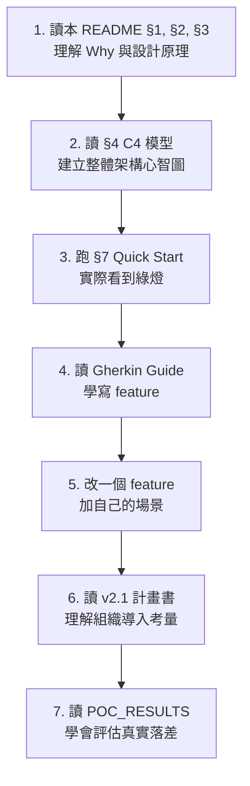

### 10.2 各角色的重點章節

| 你是 | 必讀 | 選讀 |
|------|------|------|
| **PM / Architect** | §1, §2, §3, §4.1, v2.1 計畫書 | POC_RESULTS（理解風險） |
| **BA / QA** | §3.1, §6, Gherkin Guide, 各 feature 檔 | §4 C4 模型 |
| **Developer** | §3, §4.3, §4.4, §6, Step Definition 程式碼 | §5 序列圖 |
| **DevOps** | §4.2, §5, §7, 所有 manifests/, kind/up.sh | POC_RESULTS（雷區清單） |

### 10.3 進階主題

- **加新的 Phase**：在 `features/` 加 feature、`pom.xml` 加 profile、`50-presit-jobs.yaml` 加 Job
- **接 Slack / Email 通知**：在 Phase 4 結尾 webhook 推 `presit-decision.json`
- **多環境支援**：用 ArgoCD ApplicationSet 對 dev/sit/uat 個別產生
- **效能基線收斂**：定期收集 `phase-4/cucumber-report.json` 的 latency 數據，逐步緊縮 P95 門檻

---

## 附錄 A：Gherkin zh-TW 關鍵字速查

| Gherkin 英文 | zh-TW | 用途 |
|-------------|-------|------|
| Feature | 功能 | 測試功能描述 |
| Background | 背景 | 每個場景前的共用前置 |
| Scenario | 場景 | 單一測試案例 |
| Scenario Outline | 場景大綱 | 數據驅動測試 |
| Examples | 例子 | 場景大綱的數據表 |
| Given | 假設 | 前置條件 |
| When | 當 | 操作動作 |
| Then | 那麼 | 預期結果 |
| And | 並且 | 連接同類步驟 |
| But | 但是 | 連接反向條件 |

⚠️ **不存在的關鍵字**（v2.0 真的踩雷過 → v2.1 已修）：`因為`、`否則`。請改用 `# 註解` 或 `並且`。

---

## 附錄 B：本專案的版本軌跡

| 版本 | 狀態 | 通過率 | 決策 |
|------|------|--------|------|
| v2.0 plan-faithful baseline | ❌ 7 個 case 失敗 | 86% | NO-GO |
| v2.1 A 路線修正後 | ✅ 全綠 | 100% | **GO** |

詳見 [`presit-bdd-demo/poc/POC_RESULTS.md`](presit-bdd-demo/poc/POC_RESULTS.md) §1。

---

**授權**：本教學依專案根目錄授權釋出。upstream PetClinic image 屬其原始作者（[spring-petclinic/spring-petclinic-microservices](https://github.com/spring-petclinic/spring-petclinic-microservices)）。
