# Pre-SIT 容器化資料庫驗證 — 教學專案

> **一句話描述**：在應用部署到 SIT 環境**之前**，用「容器化 DB + BDD 自動化測試 + GitOps」建立一道品質閘門，並用 PetClinic 微服務作為實際範例完整端到端示範。

[]()
[]()
[]()

---

## 目錄

1. [這份教學要解決的問題](#1-這份教學要解決的問題)
2. [核心設計原理](#2-核心設計原理)
3. [C4 模型架構圖](#3-c4-模型架構圖)
4. [Phase 1–4 執行序列圖](#4-phase-14-執行序列圖)
5. [BDD 框架類別圖](#5-bdd-框架類別圖)
6. [完整文件導覽](#6-完整文件導覽)
7. [Quick Start（從零跑起 PoC）](#7-quick-start從零跑起-poc)
8. [目錄結構說明](#8-目錄結構說明)
9. [常見問題（FAQ）](#9-常見問題faq)
10. [延伸學習路徑](#10-延伸學習路徑)

---

## 1. 這份教學要解決的問題

### 1.1 真實世界的痛點

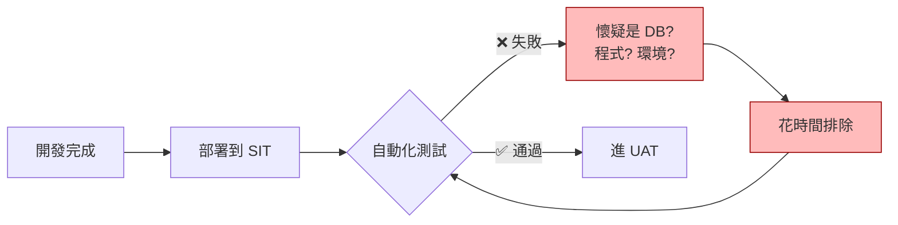

| 問題 | 影響 |
|------|------|
| SIT 資料庫狀態不可控（前個專案污染、缺資料、Schema 漂移） | 自動化測試結果不可重現 |
| 缺陷在 SIT 才被發現 | 修復成本高（已過 dev → CI → SIT 三層） |
| 驗證結果難以追溯 | 無法量化品質、無法產生上線決策依據 |
| 測試需求與業務需求脫節 | QA/BA 看不懂測試代碼，覆蓋盲區持續累積 |

### 1.2 本教學的解法

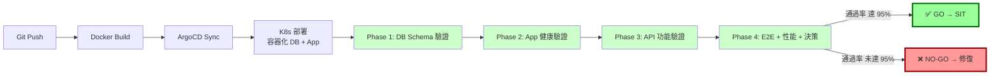

**四個關鍵移動**：

1. **資料庫容器化** — Postgres 跑在 K8s，InitContainer 每次重建 schema + 種子資料，做到「每次測試從同一狀態出發」
2. **BDD 業務語言** — Gherkin (zh-TW) 寫場景，BA/QA 可讀可寫；Step Definition 用 Java 實現，Developer 維護
3. **Pre-SIT phase 提前攔截** — 4 個獨立 Phase（DB→App→API→E2E）依序執行，前序失敗後序可選擇短路或續跑收集證據
4. **量化決策** — Cucumber 報告 → JSON 彙整 → 數字化 Go/No-Go 決策

---

## 2. 核心設計原理

### 2.1 三層分離原則

```
業務語言層    Gherkin Feature        ← BA / QA 維護，純自然語言
                ↓ (cucumber.glue)
技術實現層    Step Definition Java   ← Developer 維護，JDBC / HTTP / kubectl
                ↓ (Maven Surefire)
執行環境層    JUnit 5 + K8s Job     ← DevOps 維護，CI/CD 整合
```

每一層只關心自己的事，**修改一層不影響另一層**：
- BA 改場景描述 → 不需動 Java
- Developer 換 ORM 工具 → 不需動 Gherkin
- DevOps 換 K8s 版本 → 不需動 step

### 2.2 Phase 依賴鏈（DAG）

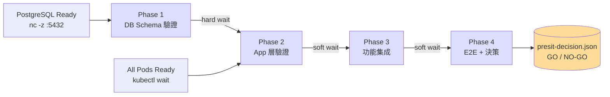

| 等待類型 | 寫法 | 行為 |
|---------|------|------|
| **hard wait** | `kubectl wait --for=condition=complete job/...` | 前序失敗則自身放棄 |
| **soft wait** | `kubectl wait --for=condition=complete job/... \|\| true` | 前序失敗仍繼續，便於一次 rerun 收齊證據 |

> 關鍵設計：Phase 3/4 的 initContainer 用 **soft wait**，使前序失敗時後序仍可執行，便於**一次 rerun 收集完整失敗證據**，避免反覆人工觸發。

### 2.3 兩種 DB 的策略性切割

PoC 過程發現「Plan-faithful + upstream PetClinic image」根本不相容（upstream 沒有 `postgres` profile）。v2.1 採取明確切割：

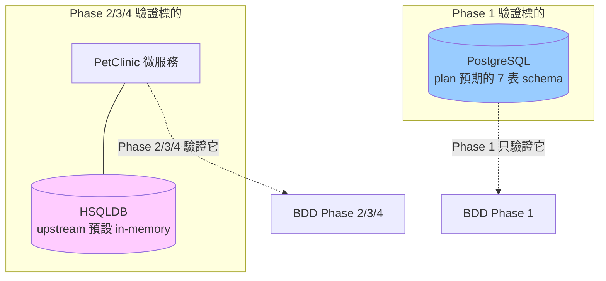

兩者**故意不相通** — 這個 trade-off 在 [`Pre-SIT_Work_Plan_v2.1.md §1.3 C1`](Pre-SIT_Work_Plan_v2.1.md) 有完整論述。如需端對端綁定，必須重 build PetClinic（脫離 upstream-as-is 約束）。

### 2.4 Tag-based 場景分層

```
@pre-sit       ← 全部測試的 root tag
├── @phase-1   ← 跑 mvn test -P phase-1
├── @phase-2
├── @phase-3
├── @phase-4
├── @smoke         ← 冒煙快速回饋（2 分鐘）
├── @critical      ← critical path，任一失敗即 NO-GO
└── @known-issue   ← 已知 upstream 行為差異，CI 預設排除
```

組合篩選範例：
```bash
mvn test -Dcucumber.filter.tags="@phase-2 and @smoke"
mvn test -Dcucumber.filter.tags="@critical and not @known-issue"
```

---

## 3. C4 模型架構圖

### 3.1 L1 — System Context（系統情境）

> 誰在用這個系統？它與外界如何互動？

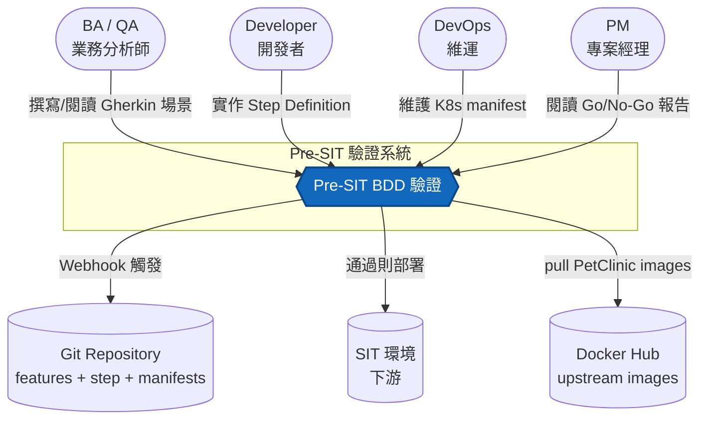

### 3.2 L2 — Container（容器）

> Pre-SIT 系統內部由哪些技術運行單元組成？

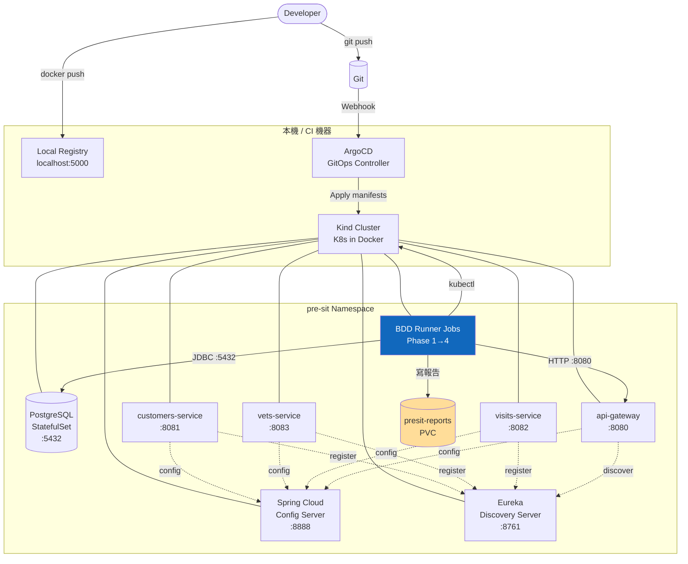

### 3.3 L3 — Component（元件）

> 「BDD Runner」這個 container 內部由哪些程式元件組成？

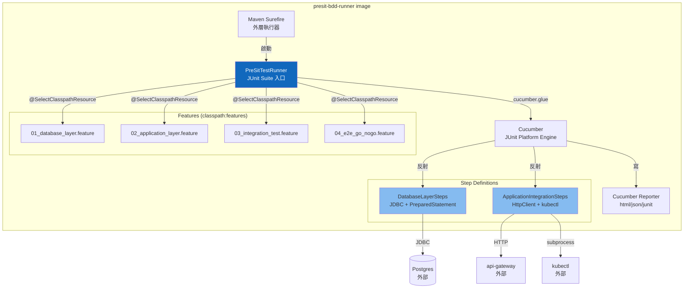

### 3.4 L4 — Code（程式碼層）

> 一個 Gherkin step 如何對應到一行 Java assertion？

以「Phase 1 場景 4：所有業務表的主鍵約束正確」為例：

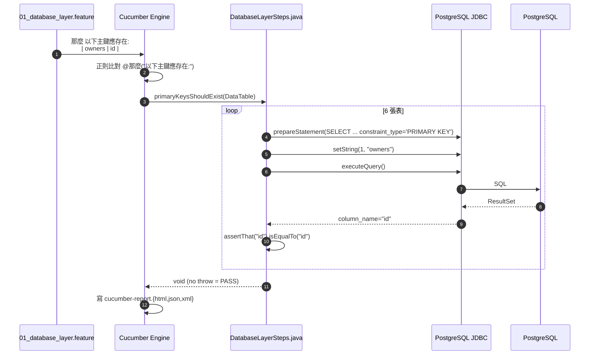

---

## 4. Phase 1–4 執行序列圖

### 4.1 整體 CI/CD 流程

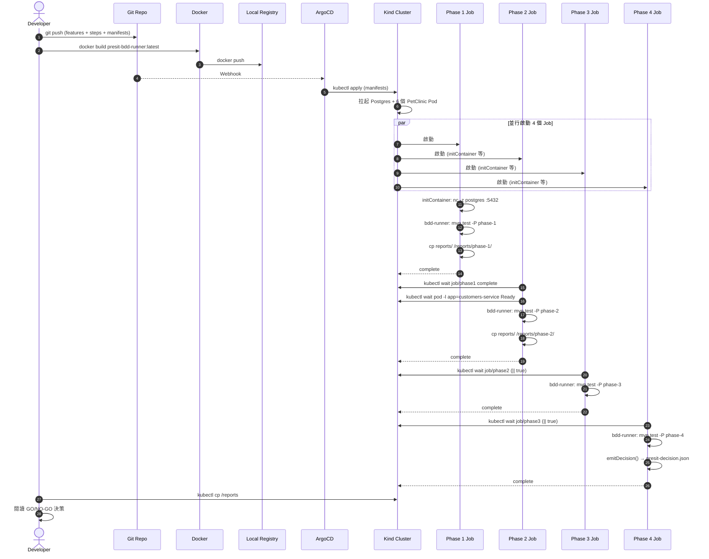

### 4.2 Phase 1：DB Schema 驗證內部流程

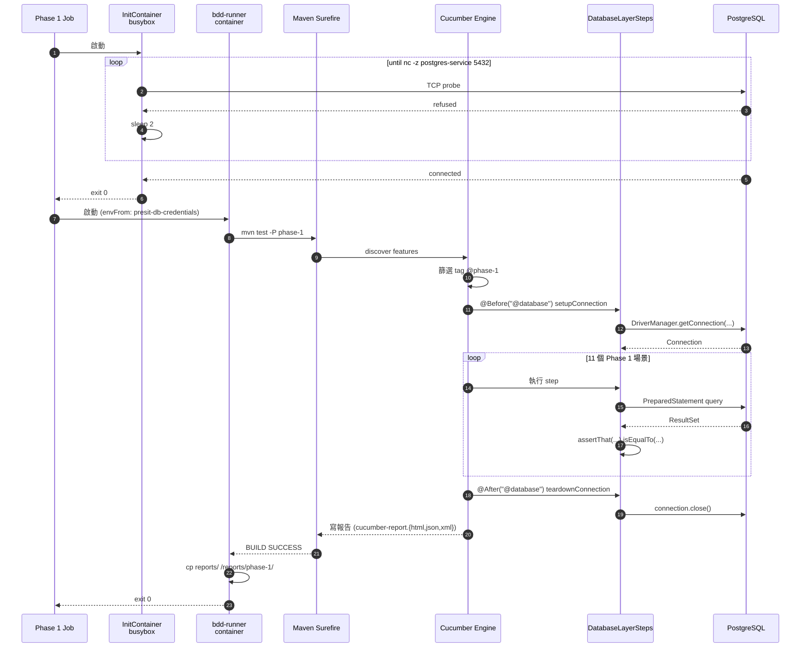

### 4.3 Phase 4：Go/No-Go 決策算法

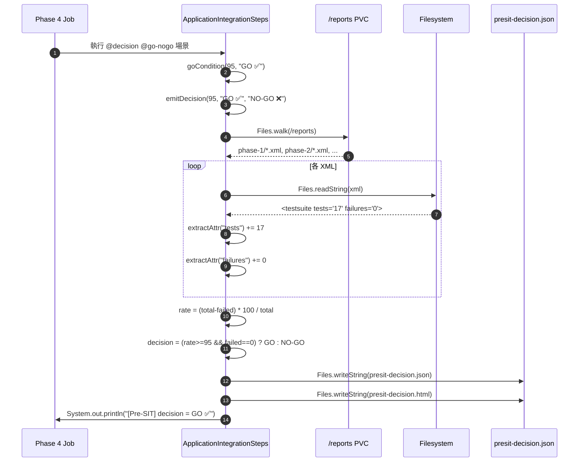

---

## 5. BDD 框架類別圖

### 5.1 測試專案類別結構

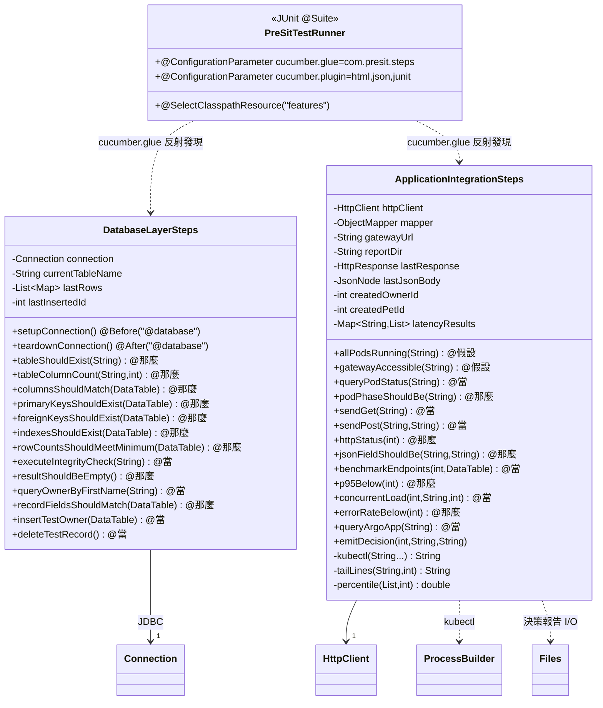

### 5.2 Cucumber Engine 與 Step 的綁定機制

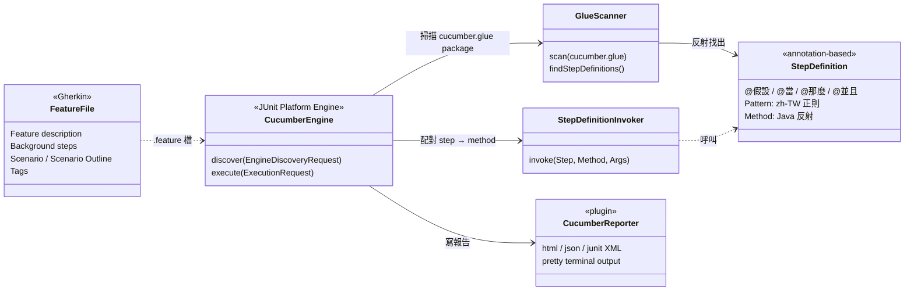

### 5.3 K8s Job 物件關係

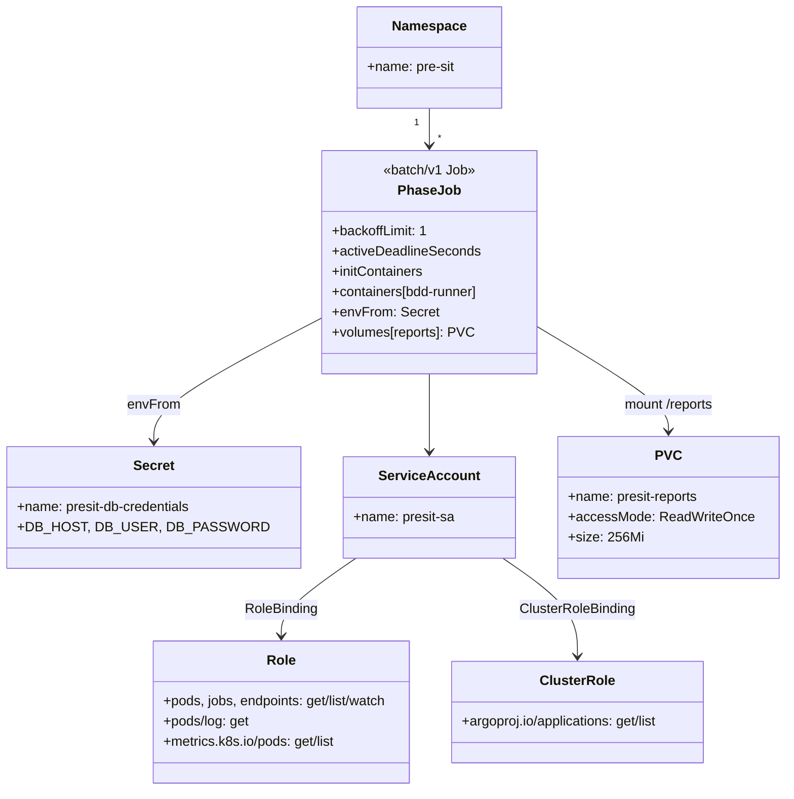

---

## 6. 完整文件導覽

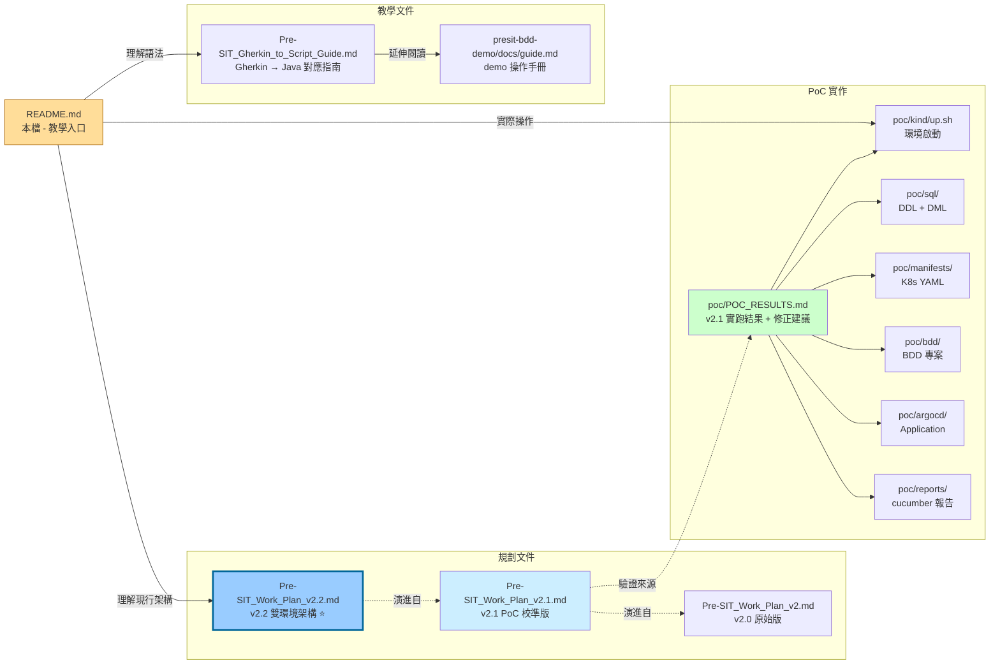

| 文件 | 角色 | 何時讀 |
|------|------|--------|
| **`README.md`** ⭐ (本檔) | 入口與全貌 | 第一次接觸時 |
| **[`Pre-SIT_Work_Plan_v2.2.md`](Pre-SIT_Work_Plan_v2.2.md)** ⭐ | **現行工作計畫書（v2.2，雙環境 + vendor PetClinic + Flyway + Jenkins + Ingress）** | 規劃 / 驗收 / 新加入專案 |
| [`Pre-SIT_Work_Plan_v2.1.md`](Pre-SIT_Work_Plan_v2.1.md) | 上一代計畫書（v2.1，plan-faithful + upstream-as-is，PoC 已達 100% GO） | 對照 v2.1 → v2.2 的架構轉向 |
| [`Pre-SIT_Work_Plan_v2.md`](Pre-SIT_Work_Plan_v2.md) | v2.0 原始版（最初版本） | 想完整理解版本演進 |
| **[`Pre-SIT_Gherkin_to_Script_Guide.md`](Pre-SIT_Gherkin_to_Script_Guide.md)** | Gherkin ↔ Java step 對應教學 | 寫測試前 |
| **[`presit-bdd-demo/poc/POC_RESULTS.md`](presit-bdd-demo/poc/POC_RESULTS.md)** | v2.1 PoC 實跑成績、失敗 case 分析、A 路線修正 | 想知道「真的能跑嗎、會踩什麼雷」 |
| [`presit-bdd-demo/docs/guide.md`](presit-bdd-demo/docs/guide.md) | v2.0 原始 demo 操作手冊 | 對照 v2.0 demo 版本 |
| [`presit-bdd-demo/poc/`](presit-bdd-demo/poc/) | 可實際執行的 v2.1 PoC 程式碼 | 想跑或修改 v2.1 版 |

### 6.1 三個計畫書版本的選擇指引

| 你的情境 | 看哪一份 |
|----------|----------|
| 第一次接觸這個專案、想快速理解全貌 | **README.md**（本檔） |
| 要新組織導入、要寫提案 / 要簽核 | **v2.2**（雙環境、vendored source、完整 CI/CD） |
| 已經有 v2.1 PoC、想知道升級路徑 | **v2.2 §10**「v2.1 → v2.2 變更對照」 |
| 想用最少資源跑通一個 demo | **v2.1** + `presit-bdd-demo/poc/`（已可跑、100% GO） |
| 學術 / 教學 / 想了解設計演進 | 依序 v2.0 → v2.1 → v2.2 |

---

## 7. Quick Start（從零跑起 PoC）

### 7.1 先決條件

| 工具 | 版本 | 用途 |
|------|------|------|
| Docker | 20+ | 容器執行時 |
| Kind | 0.24+ | 本地 K8s |
| kubectl | 1.28+ | K8s CLI |
| Java | 17+ | BDD 編譯 |
| Maven | 3.9+ | 依賴管理 |
| Helm | (optional) | ArgoCD 替代安裝法 |

驗證：
```bash
for c in docker kind kubectl java mvn; do printf "%-10s " $c; $c --version 2>&1 | head -1; done
```

### 7.2 五個指令跑完整 PoC

```bash
# 1) Kind 集群 + 本地 registry
./presit-bdd-demo/poc/kind/up.sh

# 2) ArgoCD
kubectl create namespace argocd
kubectl apply -n argocd -f https://raw.githubusercontent.com/argoproj/argo-cd/v2.13.1/manifests/install.yaml
kubectl -n argocd wait --for=condition=Available deployment --all --timeout=300s

# 3) 部署 Postgres + 6 個 PetClinic 服務
kubectl apply -f presit-bdd-demo/poc/manifests/00-namespace.yaml
kubectl -n pre-sit create configmap postgres-init-scripts \
  --from-file=presit-bdd-demo/poc/sql/01-schema.sql \
  --from-file=presit-bdd-demo/poc/sql/02-sample-data.sql
kubectl apply -f presit-bdd-demo/poc/manifests/10-postgres.yaml \
              -f presit-bdd-demo/poc/manifests/20-config-server.yaml \
              -f presit-bdd-demo/poc/manifests/30-discovery-server.yaml \
              -f presit-bdd-demo/poc/manifests/40-microservices.yaml

# 4) 編譯並推 BDD runner image
(cd presit-bdd-demo/poc/bdd && \
   docker build -t localhost:5000/presit-bdd-runner:latest . && \
   docker push localhost:5000/presit-bdd-runner:latest)

# 5) 跑 4 Phase Jobs
kubectl apply -f presit-bdd-demo/poc/manifests/50-presit-jobs.yaml
kubectl get jobs -n pre-sit -l app=presit-validation -w
```

### 7.3 取出決策報告

```bash
# 起一個 sidecar pod 把 PVC 拉出來
kubectl run report-fetcher -n pre-sit --image=busybox:1.36 \
  --overrides='{"spec":{"containers":[{"name":"c","image":"busybox","command":["sleep","600"],"volumeMounts":[{"name":"r","mountPath":"/reports"}]}],"volumes":[{"name":"r","persistentVolumeClaim":{"claimName":"presit-reports"}}]}}'
kubectl wait pod/report-fetcher -n pre-sit --for=condition=Ready --timeout=60s
kubectl cp pre-sit/report-fetcher:/reports ./local-reports
cat local-reports/presit-decision.json
xdg-open local-reports/phase-1/cucumber-report.html
```

### 7.4 本機快速迭代（不過 K8s）

```bash
cd presit-bdd-demo/poc/bdd
kubectl -n pre-sit port-forward svc/postgres-service 15432:5432 &
kubectl -n pre-sit port-forward svc/api-gateway     18080:8080 &
DB_HOST=localhost DB_PORT=15432 \
GATEWAY_URL=http://localhost:18080 \
REPORT_DIR=$(pwd)/reports \
mvn test -P phase-1   # 或 phase-2 / phase-3 / phase-4
```

### 7.5 v2.3 Stage C：Jenkins CI/CD 自動化 （在 Kind 內）

Jenkins 作為 Pre-SIT 的 CI/CD orchestrator，部署在同一個 Kind 叢集，透過 kubectl（in-cluster）觸發 BDD 鏈並讀取決策。

#### 前提：v2.2 雙環境已就緒

```bash
# 確認 ArgoCD 兩個 Application 存在
kubectl -n argocd get application petclinic-pre-sit petclinic-sit
# 確認 pre-sit namespace 有 BDD RBAC（一次性 setup）
kubectl apply -f manifests/pre-sit/25-presit-sa.yaml
```

#### 啟動 Jenkins

```bash
# 部署 Jenkins（含 ServiceAccount + RBAC）
kubectl apply -f manifests/jenkins/00-namespace.yaml
kubectl apply -f manifests/jenkins/05-rbac.yaml
kubectl apply -f manifests/jenkins/10-jenkins.yaml

# 等待就緒（initContainer 安裝 kubectl + plugins 約需 2–3 分鐘）
kubectl wait -n jenkins deployment/jenkins \
  --for=condition=Available --timeout=300s
```

#### 觸發 Pipeline

```bash
# 從 Kind 節點 IP 進入 Jenkins UI（無密碼）
NODE_IP=$(kubectl get node presit-control-plane -o jsonpath='{.status.addresses[0].address}')
echo "Jenkins UI: http://${NODE_IP}:30808"

# 或用 API 直接觸發（CSRF 已停用）
kubectl exec -n jenkins deploy/jenkins -- \
  curl -s -X POST http://localhost:8080/job/petclinic-presit/build
```

#### Pipeline 階段說明

| 階段 | 動作 | 預期輸出 |
|------|------|---------|
| Preflight | 驗 kubectl 可用、namespace 存在、ArgoCD apps 存在 | `kubectl v1.36+` |
| Reset Pre-SIT | 清舊 jobs/PVC、重啟 postgres + deployments | `pod/postgres-0 condition met` |
| Apply BDD Jobs | `kubectl apply manifests/pre-sit/30-bdd-jobs.yaml` | 4 jobs created |
| Wait Phase 1-4 | Polling 每 15 秒檢查 phase4 condition（支援 K8s 1.29+ `SuccessCriteriaMet`） | `Phase 4 done: SuccessCriteriaMet Complete` |
| Read decision | 讀 phase4 logs，解析 JSON | `"decision":"GO ✅"` |
| Check SIT state | 顯示 SIT 4 個 deployment 的現行 image | `:sit-approved` |

#### 已知限制（v2.4 backlog）

- Jenkins 無法收到 GitHub webhook（Kind 不對外）→ 手動觸發或 polling SCM
- Image build（mvn package + docker build/push）留給 v2.4 用 kaniko 或 DinD sidecar

### 7.6 v2.3 Observability：Prometheus + Grafana + Loki

集中觀測 pre-sit 和 SIT 兩個環境的 metrics 與 logs，無需 kubectl exec 就能看到服務健康狀態。

#### 元件

| 元件 | 用途 | 安裝方式 |
|------|------|---------|
| Prometheus | 抓取所有 PetClinic `/actuator/prometheus` metrics | kube-prometheus-stack Helm |
| Grafana | 視覺化儀表板 | kube-prometheus-stack Helm（NodePort 30300） |
| Loki | log 聚合（pre-sit / sit / jenkins / bdd runner） | grafana/loki-stack Helm |
| Promtail | 各 pod log 收集 DaemonSet | grafana/loki-stack Helm |

#### 一鍵安裝

```bash
bash scripts/setup-monitoring.sh
```

或分步驟：

```bash
helm upgrade --install kube-prometheus prometheus-community/kube-prometheus-stack \
  --namespace monitoring \
  --values manifests/monitoring/values-kube-prometheus.yaml \
  --set grafana.sidecar.dashboards.enabled=true \
  --set grafana.sidecar.dashboards.label=grafana_dashboard \
  --wait

helm upgrade --install loki grafana/loki-stack \
  --namespace monitoring \
  --values manifests/monitoring/values-loki.yaml \
  --wait

kubectl apply -f manifests/monitoring/10-servicemonitors.yaml
kubectl apply -f manifests/monitoring/20-dashboards.yaml
```

> **Kind 注意**：需先提高 inotify 限制（Promtail DaemonSet 需要）：
> ```bash
> docker exec presit-control-plane sysctl -w \
>   fs.inotify.max_user_instances=512 \
>   fs.inotify.max_user_watches=524288
> ```

#### 訪問 Grafana

```
http://<kind-node-ip>:30300    帳號: admin  密碼: presit-admin
```

內建兩個 Dashboard：
- **Pre-SIT Pipeline Overview** — HTTP request rate、P95 latency、JVM heap、5xx error rate（pre-sit + SIT 對比）
- **Pre-SIT / SIT Logs (Loki)** — 三個 log panel：pre-sit、SIT、BDD runner jobs

#### 驗收指標

```bash
# 確認 8 個 PetClinic 服務都被 Prometheus 抓到
kubectl port-forward -n monitoring svc/kube-prometheus-kube-prome-prometheus 9090:9090 &
curl -s 'http://localhost:9090/api/v1/targets?state=active' | \
  python3 -c "
import sys,json; d=json.load(sys.stdin)
t=[x for x in d['data']['activeTargets'] if x['labels'].get('namespace') in ('pre-sit','sit')]
print(f'{sum(1 for x in t if x[\"health\"]==\"up\")}/{len(t)} petclinic targets up')
"
# 預期輸出: 8/8 petclinic targets up
```

### 7.7 v2.3 Sealed Secrets：消除 Git 明文密碼

`manifests/pre-sit/05-config.yaml` 和 `manifests/sit/05-config.yaml` 原先直接包含明文 `POSTGRES_PASSWORD`。v2.3 改用 Bitnami Sealed Secrets，讓密碼以非對稱加密後的密文存入 Git，只有 cluster 內的 controller 能解封。

#### 元件

| 元件 | 用途 |
|------|------|
| `sealed-secrets-controller` | kube-system namespace，持有私鑰，負責解封 SealedSecret → Secret |
| `kubeseal` CLI | 用 controller 公鑰把明文 Secret 加密成 SealedSecret |

#### 一鍵安裝

```bash
bash scripts/setup-sealed-secrets.sh
```

或手動：

```bash
# 安裝 controller
helm upgrade --install sealed-secrets sealed-secrets/sealed-secrets \
  --namespace kube-system --values manifests/sealed-secrets/values.yaml --wait

# 套用 SealedSecrets（ArgoCD 管理 sit；pre-sit 手動 apply）
kubectl apply -f manifests/pre-sit/06-sealed-db-credentials.yaml
# sit 由 ArgoCD petclinic-sit 自動 sync（kustomization 已含此檔）
```

> **kubeseal 安裝**（若尚未安裝）：
> ```bash
> KUBESEAL_VERSION=0.36.6
> curl -sL "https://github.com/bitnami-labs/sealed-secrets/releases/download/v${KUBESEAL_VERSION}/kubeseal-${KUBESEAL_VERSION}-linux-amd64.tar.gz" \
>   | tar -xz kubeseal && install -m 755 kubeseal ~/.local/bin/kubeseal
> ```

#### 封存新 Secret

```bash
export PATH="$HOME/.local/bin:$PATH"

kubectl create secret generic my-secret -n pre-sit \
  --from-literal=KEY=VALUE \
  --dry-run=client -o yaml \
  | kubeseal \
      --controller-name=sealed-secrets-controller \
      --controller-namespace=kube-system \
      --format yaml > manifests/pre-sit/06-my-secret.yaml

# 把輸出的 SealedSecret 加入 git — 明文不會進 repo
```

#### 驗收

```bash
# SealedSecrets 狀態
kubectl get sealedsecret -A
# 預期: pre-sit 和 sit 各一個，SYNCED=True

# 解封後的 Secret 值確認
kubectl get secret petclinic-db-credentials -n pre-sit \
  -o jsonpath='{.data.POSTGRES_USER}' | base64 -d
# 預期: petclinic
```

### 7.8 v2.3 Per-user SIT Namespace：每位測試人員獨立沙盒

多人同時測試時，共用一個 SIT namespace 會互相污染資料。v2.3 新增一行指令即可為任意使用者建立完整隔離的 SIT 環境（獨立 Postgres、獨立 Ingress host）。

#### 設計原則

| 決策 | 理由 |
|------|------|
| namespace = `sit-<username>` | K8s namespace 是最便宜的隔離邊界 |
| 每個 namespace 獨立封存 SealedSecret | Bitnami Sealed Secrets 是 namespace-scoped，同一明文在不同 namespace 有不同密文 |
| Ingress host = `<username>-sit.local` | nginx-ingress 依 Host header 路由，不需額外 port |
| `envsubst` 模板 | 無 Helm 依賴；`manifests/sit-user-template/` 只是帶 `${VAR}` 的純 YAML |
| 刪除即清理 | `kubectl delete namespace sit-<username>` 級聯刪除所有資源含 PVC |

#### 快速建立

```bash
# 建立 sit-alice
scripts/create-sit-user.sh alice

# 指定 image tag（預設 v2.2）
scripts/create-sit-user.sh bob v2.3

# 刪除
scripts/delete-sit-user.sh alice
```

腳本執行流程：
1. 建立 `sit-<username>` namespace
2. 從 `sit` namespace 讀取現有已解封 credentials → `kubeseal` 重新封存為新 namespace
3. `envsubst` 展開 `manifests/sit-user-template/` 所有 YAML → `kubectl apply`
4. 等待 Postgres rollout → 等待所有 PetClinic pods Ready
5. 印出 hosts 設定與 curl 驗收指令

#### 存取方式

```bash
# 1. 加入 /etc/hosts
echo '127.0.0.1 alice-sit.local' | sudo tee -a /etc/hosts

# 2. 瀏覽器
open http://alice-sit.local:30080/

# 3. curl 驗收
curl -s -H 'Host: alice-sit.local' http://localhost:30080/api/customer/owners | jq length
# 預期: 10
```

#### 模板檔案位置

```
manifests/sit-user-template/
├── 00-namespace.yaml        namespace (${NS}, sit-user label)
├── 05-config.yaml           ConfigMap (POSTGRES_HOST / URIs 全指向 ${NS})
├── 10-postgres.yaml         StatefulSet + Service (1Gi PVC)
├── 20-petclinic-services.yaml  4 Services + 4 Deployments (image tag = ${IMAGE_TAG})
└── 30-ingress.yaml          Ingress host = ${USERNAME}-sit.local
```

---

## 8. 目錄結構說明

```
pre-site-tutorial/
├── README.md                              ⭐ 本檔（教學入口）
├── Jenkinsfile                            ⭐ v2.3 CI/CD pipeline（5-stage orchestrator）
├── Pre-SIT_Work_Plan_v2.md                v2.0 原始工作計畫書
├── Pre-SIT_Work_Plan_v2.1.md              ⭐ v2.1 校準後工作計畫書
├── Pre-SIT_Gherkin_to_Script_Guide.md     Gherkin → Java 對應教學
├── presit-bdd-demo.tar.gz                 v2.0 原始 demo tar 包
│
├── manifests/
│   ├── jenkins/
│   │   ├── 00-namespace.yaml              Jenkins namespace
│   │   ├── 05-rbac.yaml                   SA + Role（pre-sit）+ ClusterRole（cross-ns）
│   │   └── 10-jenkins.yaml                Jenkins 2.492.3 Deployment + NodePort 30808
│   ├── monitoring/
│   │   ├── 00-namespace.yaml              monitoring namespace
│   │   ├── values-kube-prometheus.yaml    Prometheus + Grafana Helm values
│   │   ├── values-loki.yaml               Loki + Promtail Helm values
│   │   ├── 10-servicemonitors.yaml        8 個 ServiceMonitor（pre-sit + sit 各 4 服務）
│   │   └── 20-dashboards.yaml             2 個 Grafana dashboard ConfigMap
│   ├── pre-sit/
│   │   ├── 25-presit-sa.yaml              ⭐ BDD runner SA/Role/RoleBinding（一次性 setup）
│   │   └── 30-bdd-jobs.yaml               4 Phase Jobs + PVC（Jenkins 每次 apply）
│   ├── sealed-secrets/
│   │   └── values.yaml                    Sealed Secrets controller Helm values
│   ├── sit/                               SIT namespace manifests（ArgoCD 管理）
│   │   └── 06-sealed-db-credentials.yaml  ⭐ SIT DB 密碼 SealedSecret（已加入 kustomization）
│   └── sit-user-template/                 ⭐ Per-user SIT namespace 模板（envsubst）
│       ├── 00-namespace.yaml
│       ├── 05-config.yaml
│       ├── 10-postgres.yaml
│       ├── 20-petclinic-services.yaml
│       └── 30-ingress.yaml
│
├── scripts/
│   ├── setup-monitoring.sh                ⭐ 一鍵安裝 Prometheus + Grafana + Loki
│   ├── setup-sealed-secrets.sh            ⭐ 一鍵安裝 Sealed Secrets controller
│   ├── create-sit-user.sh                 ⭐ 建立 per-user SIT namespace
│   └── delete-sit-user.sh                 刪除 per-user SIT namespace
│
└── presit-bdd-demo/                       v2.0 原始 demo 與 v2.1 PoC
    ├── features/                          v2.0 demo: Gherkin
    ├── step-definitions/                  v2.0 demo: Java steps（含已知 bugs，僅供對比）
    ├── runners/                           v2.0 demo: Runner
    ├── pom.xml                            v2.0 demo: 非標準 Maven layout
    ├── k8s/presit-validation-jobs.yaml    v2.0 demo: K8s Jobs
    ├── scripts/run-presit.sh              v2.0 demo: 本地腳本
    ├── Dockerfile                         v2.0 demo: BDD runner image
    ├── docs/guide.md                      v2.0 demo: 操作手冊
    │
    └── poc/                               ⭐ v2.1 校準後可實跑完整 PoC
        ├── POC_RESULTS.md                 PoC 結果（100% GO）
        ├── kind/
        │   ├── kind-config.yaml           Kind + containerd mirror
        │   └── up.sh                      冪等啟動腳本
        ├── sql/
        │   ├── 01-schema.sql              7 表 schema（對應 Phase 1 全部斷言）
        │   └── 02-sample-data.sql         筆數達門檻 + George Franklin
        ├── manifests/
        │   ├── 00-namespace.yaml
        │   ├── 10-postgres.yaml           StatefulSet + Service + initdb mount
        │   ├── 20-config-server.yaml
        │   ├── 30-discovery-server.yaml
        │   ├── 40-microservices.yaml      4 服務（含 JVM 調整 + show-details）
        │   └── 50-presit-jobs.yaml        4 Phase Jobs + RBAC + PVC + Secret
        ├── argocd/
        │   └── petclinic-pre-sit.yaml     ArgoCD Application
        ├── bdd/                           標準 Maven layout BDD 專案
        │   ├── pom.xml
        │   ├── Dockerfile
        │   └── src/test/{java,resources}/...
        └── reports/                       PVC 拉出的 cucumber 報告
            ├── presit-decision.{html,json}
            └── phase-{1,2,3,4}/cucumber-report.{html,json,xml}
```

### 8.1 為什麼分 v2.0 demo 與 v2.1 PoC？

- **v2.0 demo**（`presit-bdd-demo/{features,step-definitions,runners,...}/`）保留作為「原始計畫書的初稿」，方便對照 v2.1 校準了哪些東西
- **v2.1 PoC**（`presit-bdd-demo/poc/`）是可實際跑出 ✅ GO 的完整版本，bug 已修、缺漏已補

---

## 9. 常見問題（FAQ）

### Q1：為何 Phase 1 用 Postgres、Phase 2/3/4 用 HSQLDB？這不矛盾嗎？

A：因為 upstream PetClinic image 不支援 `postgres` profile。在「不重 build upstream」前提下，Phase 1 獨立驗證「容器化 DB schema 是否能正確 reproduce」，Phase 2/3/4 驗證「應用本身是否健康可用」。詳見 [§2.3](#23-兩種-db-的策略性切割) 與 [`Pre-SIT_Work_Plan_v2.1.md §1.3 C1`](Pre-SIT_Work_Plan_v2.1.md)。

### Q2：Phase 2 記憶體門檻為何從 512 改 768 MB？

A：Spring Boot 3.2 + Spring Cloud Config + Eureka client 啟動穩態約 500–530 MiB，即使設定 `-Xmx200m -XX:MaxMetaspaceSize=160m` 也無法降到 512 以下（Metaspace + Direct Memory + Netty buffers）。v2.0 plan 寫 < 512 MB 在 upstream image 下無法達成，v2.1 已改為 768 MB。詳見 [`POC_RESULTS.md §4 F1/F2`](presit-bdd-demo/poc/POC_RESULTS.md)。

### Q3：為何 Phase 3 有一個場景被標 `@known-issue`？

A：upstream PetClinic 對未知 owner 回 `200 + 空 body`（不是 RESTful 的 404）。這是 upstream code 行為，無法用配置調整。v2.1 將該場景標 `@known-issue`，phase-3 Maven profile 設 `not @known-issue` 排除。詳見 [`POC_RESULTS.md §4 F7`](presit-bdd-demo/poc/POC_RESULTS.md)。

### Q4：可以只跑 Phase 1 嗎？

A：可以：

```bash
cd presit-bdd-demo/poc/bdd
mvn test -P phase-1     # 只跑 Phase 1
mvn test -P smoke       # 只跑 @smoke
mvn test -Dcucumber.filter.tags="@critical and not @known-issue"
```

### Q5：實際企業環境要改哪些東西？

| 環境差異 | 修改點 |
|----------|--------|
| 不用 Kind 用真正 K8s | `kind/up.sh` → 換成 Helm chart 或 Terraform |
| 不用 localhost:5000 用 Harbor / ECR | 改 `manifests/40-microservices.yaml` 與 BDD Dockerfile 的 image 路徑 |
| 不要 Eureka，改用 K8s Service Discovery | 重 build api-gateway 改用 Spring Cloud Kubernetes |
| 真正用 Postgres 而非 HSQLDB | 重 build PetClinic 服務、加入 postgres profile |
| ArgoCD 接真正的 Git | `argocd/petclinic-pre-sit.yaml` 改 `repoURL` |
| CI/CD 整合（已實作 v2.3） | Jenkins 部署在 Kind 內；`manifests/jenkins/` + `Jenkinsfile` 已就緒，見 [§7.5](#75-v23-stage-cjenkins-cicd-自動化-在-kind-內) |
| 觀測性（已實作 v2.3） | Prometheus + Grafana + Loki 已部署；`manifests/monitoring/` + `scripts/setup-monitoring.sh`，見 [§7.6](#76-v23-observabilityprometheus--grafana--loki) |
| 明文密碼消除（已實作 v2.3） | Sealed Secrets controller 替換明文 Secret；`manifests/sealed-secrets/` + `06-sealed-db-credentials.yaml`，見 [§7.7](#77-v23-sealed-secrets消除-git-明文密碼) |
| 多人共用 SIT 資料互污（已實作 v2.3） | 一行指令建立隔離 namespace；`scripts/create-sit-user.sh <username>`，見 [§7.8](#78-v23-per-user-sit-namespace每位測試人員獨立沙盒) |

---

## 10. 延伸學習路徑

### 10.1 推薦閱讀順序

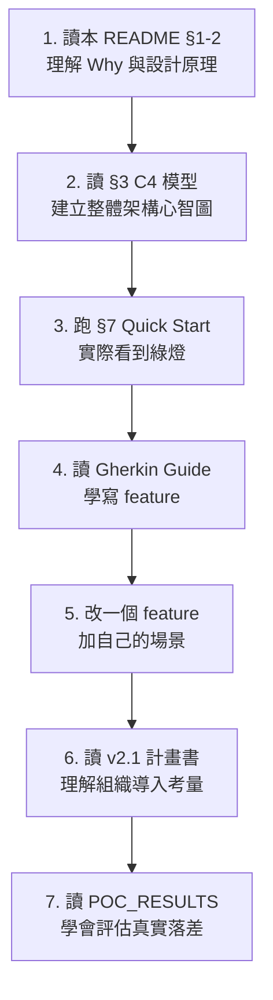

### 10.2 各角色的重點章節

| 你是 | 必讀 | 選讀 |
|------|------|------|
| **PM / Architect** | §1, §2, §3.1, §6, v2.1 計畫書 | POC_RESULTS（理解風險） |
| **BA / QA** | §2.1, §5, Gherkin Guide, 各 feature 檔 | §3 C4 模型 |
| **Developer** | §2, §3.3, §3.4, §5, Step Definition 程式碼 | §4 序列圖 |
| **DevOps** | §3.2, §4, §7, 所有 manifests/, kind/up.sh | POC_RESULTS（雷區清單） |

### 10.3 進階主題

- **加新的 Phase**：在 `features/` 加 feature、`pom.xml` 加 profile、`50-presit-jobs.yaml` 加 Job
- **接 Slack / Email 通知**：在 Phase 4 結尾 webhook 推 `presit-decision.json`
- **多環境支援**：用 ArgoCD ApplicationSet 對 dev/sit/uat 個別產生
- **效能基線收斂**：定期收集 `phase-4/cucumber-report.json` 的 latency 數據，逐步緊縮 P95 門檻

---

## 附錄 A：Gherkin zh-TW 關鍵字速查

| Gherkin 英文 | zh-TW | 用途 |
|-------------|-------|------|
| Feature | 功能 | 測試功能描述 |
| Background | 背景 | 每個場景前的共用前置 |
| Scenario | 場景 | 單一測試案例 |
| Scenario Outline | 場景大綱 | 數據驅動測試 |
| Examples | 例子 | 場景大綱的數據表 |
| Given | 假設 | 前置條件 |
| When | 當 | 操作動作 |
| Then | 那麼 | 預期結果 |
| And | 並且 | 連接同類步驟 |
| But | 但是 | 連接反向條件 |

⚠️ **不存在的關鍵字**（v2.0 真的踩雷過 → v2.1 已修）：`因為`、`否則`。請改用 `# 註解` 或 `並且`。

---

## 附錄 B：本專案的版本軌跡

| 版本 | 狀態 | 通過率 | 決策 |
|------|------|--------|------|
| v2.0 plan-faithful baseline | ❌ 7 個 case 失敗 | 86% | NO-GO |
| v2.1 A 路線修正後 | ✅ 全綠 | 100% | **GO** |

詳見 [`presit-bdd-demo/poc/POC_RESULTS.md`](presit-bdd-demo/poc/POC_RESULTS.md) §1。

---

**授權**：本教學依專案根目錄授權釋出。upstream PetClinic image 屬其原始作者（[spring-petclinic/spring-petclinic-microservices](https://github.com/spring-petclinic/spring-petclinic-microservices)）。
